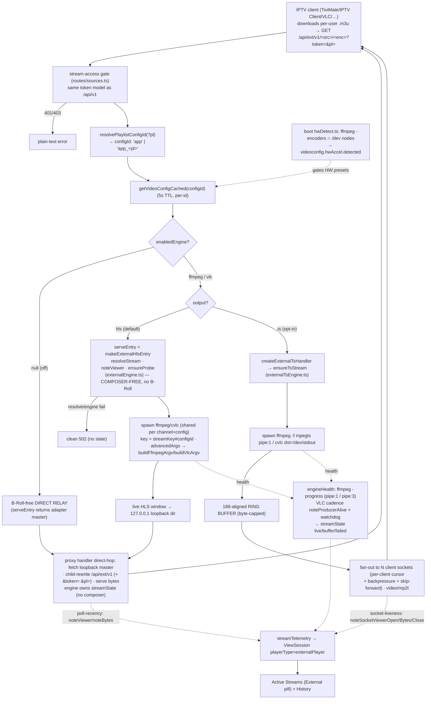

<div align="center">

  <p><em>Aggregating scattered IPTV sources behind a single, trusted identity.</em></p>
  <div style="display:flex; justify-content:center; align-items:center; gap:15px;">
    
    
    
  </div>
</div>

# What is `masqueradarr`

**masqueradarr** is a self-hosted IPTV aggregator. It pulls channel playlists (M3U) and guide
data (EPG/XMLTV) from a range of online IPTV services, normalizes them into one catalog, and
serves them back as a single, unified, standards-compliant playlist + guide — behind one trusted
identity that your media apps and IPTV clients can talk to.

It is the direct successor to **[TVApp2](https://github.com/TheBinaryNinja/tvapp2)**, which is now
**deprecated**. masqueradarr is not a fork or a patch — it is a ground-up re-architecture of the same
idea, carrying the project into the `*arr` self-hosted media family (Sonarr, Radarr, …) it's named for.


> [!NOTE] 
> View more [screenshots](/docs/img/screenshots) of the current system including the updated branding and layout.


# Evolution — **masqueradarr**

### Where it started: **TVApp2**

TVApp2 was a single, self-contained Docker container whose job was simple and effective: on a
schedule, **scrape a handful of IPTV providers** (TheTvApp, TVPass, MoveOnJoy), **download and
regenerate flat `.m3u` and `.xml` files**, and serve them over a small web interface so that
Jellyfin, Plex, or Emby could ingest them. It was a Node.js app on an **Alpine Linux** base,
supervised by **s6-overlay**, configured almost entirely through **environment variables**, with
HDHomeRun emulation and HD/SD quality toggles. It did one thing well — keep static playlists fresh.

That model had ceilings. Streams were **static URLs** baked into files, so anything behind a login,
a device check, an expiring token, or a rotating mirror couldn't be served. There was **no database**,
**no real UI** beyond file links, **no per-user access control**, **no live observability** of who was
watching what, and **no transcoding** for clients that couldn't play the upstream format. Every new
provider meant bespoke scraping glued into the core.

### Where it's going: masqueradarr

masqueradarr keeps the original promise — *aggregate scattered IPTV sources into one playlist + guide* —
and rebuilds everything underneath it to lift those ceilings:

- **Static files → a live, resolve-on-demand engine.** Instead of writing dead URLs to disk,
  masqueradarr resolves each stream **at play time** through an HLS proxy. That's what makes
  **authenticated** and **rotating** sources possible — e.g. an in-app, server-streamed Chromium
  captures a real login session, and per-play signed URLs are minted on demand.
- **Flat config → MongoDB + a real management SPA.** State lives in MongoDB; the front end is a
  **Vue 3 single-page app** with full screens for Dashboard, Active Streams, History / Metrics,
  Playlists, EPG Sources, Channel Mapping, Users, and Settings.
- **Bespoke scrapers → a source-agnostic adapter framework.** Adding a provider is one adapter file
  plus one registry line; the generic core (sync, proxy, B-Roll, telemetry) never branches per source.
- **File server → an API + two delivery surfaces.** An in-app player **and** an external-client
  engine that transcodes for TiviMate / Kodi / VLC, with **GPU hardware acceleration** (NVENC / VAAPI / QSV).
- **Env-var toggles → users, roles & per-user access.** Real authentication (scrypt), session vs.
  stream tokens, and per-user tokenized playlist access.
- **Blind scheduling → live observability.** WebSocket-pushed viewer/bandwidth/buffering telemetry,
  ffprobe stream monitoring, a B-Roll placeholder slate while a channel buffers, and MongoDB-backed
  application logs.

### At a glance

| | **TVApp2** (deprecated) | **masqueradarr** |
|---|---|---|
| **Role** | Static M3U/XMLTV regenerator | Live IPTV aggregator + delivery platform |
| **Streams** | Static URLs written to files | Resolve-on-demand via HLS proxy |
| **State** | Flat files, no DB | MongoDB (Mongoose 8) |
| **Frontend** | Links to generated files | Vue 3 + Vite management SPA |
| **Backend** | Node.js scripts | Express 4 API (ESM, TypeScript) |
| **Sources** | Hard-coded scrapers (TheTvApp, TVPass, MoveOnJoy) | Pluggable adapters (dulo, dlhd, …) |
| **Auth** | None | scrypt users, roles, per-user access lists |
| **Auth'd sources** | Not possible | Supported (streamed-login session capture) |
| **External clients** | Pass-through only | ffmpeg/VLC transcode engine, GPU HW accel |
| **Observability** | Logs | Live WS telemetry, history/metrics, ffprobe, app logs |
| **Base image** | Alpine + s6-overlay | Debian bookworm (glibc) + tini |
| **Config** | Environment variables | DB-backed settings + minimal `.env` bootstrap |

### Architecture

masqueradarr is **two independently-built, independently-versioned npm packages** that the Docker
image stitches together — *not* a workspace, and they never import across the boundary:

- **`/` (root)** — the **Vue 3 + Vite SPA** (the management front end; `hls.js`, `vue-router`, `mitt`).
- **`server/`** — the **Express 4 + Mongoose 8 API** (ESM, TypeScript `strict`), which serves the
  built SPA, the `/api/*` REST surface, the HLS proxy + external-player engine, and three WebSockets
  (login-stream, stream-stats, logs-stream).

Key subsystems:

- **Sources adapter framework** — a source-agnostic core (sync → normalize → dedupe → proxy) with
  per-provider adapters. Current sources: **dulo** (authenticated, resolve-on-demand) and **dlhd**
  (anonymous, scraped from a rotating mirror); a shared **common** tier is planned.
- **Channel model** — a pristine synced reference (`sourcechannels`) projected into an editable,
  UI-facing store (`playlistchannels`); user edits survive re-syncs.
- **EPG + scheduler** — Gracenote and EPG-PW ingestion behind a shared sync path, driven by a
  `croner`-backed runtime scheduler over a persisted `cronjobs` collection.
- **Composition + export** — composes Global, per-user, and custom `.m3u` playlists with matching
  XMLTV guide siblings for downstream clients.
- **externalPlayer engine** — ffmpeg / VLC transcode for third-party IPTV clients on a dedicated
  mount, with boot-time hardware-encoder detection.

### Migration status

The rename and re-architecture are **in flight**. The codebase, brand, and runtime are masqueradarr;
the **published Docker repositories still carry the `tvapp2` names** (`iflip721/tvapp2-app-stack` for
the standard image, `iflip721/tvapp2` for the all-in-one) until the registry rename completes. If
you're coming from TVApp2: there is **no in-place upgrade path** — masqueradarr is a new application
with a new data model (MongoDB instead of flat files), so stand it up fresh and re-add your sources
through the UI.

### Lineage & credits

masqueradarr is the successor to **[TVApp2](https://github.com/TheBinaryNinja/tvapp2)** by
[TheBinaryNinja](https://github.com/TheBinaryNinja), and inherits its core aggregation framework
(ported from the sibling project). TVApp2 remains available, archived, and deprecated —
all new development happens here.

# Features

**Aggregation & delivery**

- Pulls **M3U playlists** and **EPG / XMLTV** guide data from multiple IPTV providers and normalizes
  them into one catalog.
- **Resolve-on-demand streaming** — each stream is resolved at play time through an HLS proxy (no dead
  URLs on disk), which is what makes **authenticated**, **token-gated**, and **rotating-mirror** sources
  possible.
- **Two delivery surfaces** — an in-app slide-out player and an external-client engine for TiviMate /
  Kodi / VLC / Emby / Jellyfin / Plex.
- **Composition + export** — builds Global, per-user, and custom `.m3u` playlists, each with a matching
  XMLTV guide sibling advertised via `x-tvg-url`.

**Pluggable sources**

- A **source-agnostic adapter framework**: adding a provider is one adapter file plus one registry line;
  the generic core (sync → normalize → dedupe → proxy) never branches per source.
- **dulo** — authenticated, resolve-on-demand; the login session is captured in-app via a server-streamed
  real Chromium (the password goes straight to the provider, only tokens are persisted).
- **dlhd** — anonymous, scraped from a rotating mirror with a Referer-gated multi-hop resolve and a
  self-built EPG. A shared **common** source tier is planned.

**Management SPA** (Vue 3)

- Full screens for **Dashboard, Active Streams, History / Metrics, Playlists, EPG Sources, Channel
  Mapping, Users,** and **Settings**.
- Channel Mapping with composite match-scoring; an editable channel store where **user edits survive
  re-syncs**.

**Users & access control**

- **scrypt** authentication, **admin / user** roles, and **per-user access lists** (allowed playlists /
  custom playlists).
- A session-token vs. stream-token split, and per-user **tokenized M3U access** (token-free download,
  token-gated stream).

**Observability**

- WebSocket-pushed **viewer / bandwidth / buffering telemetry** and **ffprobe** stream monitoring.
- Persisted **view-session history** + per-user metrics, and **MongoDB-backed application logs** (12
  categories, 14-day TTL) with a live log drawer.
- A **B-Roll placeholder slate** burned into real HLS while an in-app channel is establishing or
  re-buffering — so even headless clients see something.

**Transcoding**

- An optional per-playlist **ffmpeg / VLC engine** for external clients — **loopback-HLS** (default) or
  **raw MPEG-TS** output.
- Multi-vendor **GPU hardware acceleration** (NVENC / VAAPI / QSV) with boot-time encoder detection, so
  the UI only offers what the host can actually do.

**Scheduling**

- A `croner`-backed runtime scheduler over a persisted `cronjobs` collection: playlist re-sync, EPG
  re-sync, M3U / XMLTV recompose, and scheduled backups.

# Getting started

masqueradarr ships as Docker images. There are two deployment shapes.

### Option A — Compose stack (app + MongoDB)

1. Copy the env template and fill it in:

   ```bash
   cp .env.example .env
   ```

   At minimum set `MONGO_ROOT_USER` / `MONGO_ROOT_PASS`, your `DOMAIN`, and the host volume paths
   (`COMPOSE_PATH`, `BACKUPS_PATH`, `MONGO_DATA_PATH`) — each host dir must be writable by **uid 1000**
   (the container's `node` user).

2. Bring it up:

   ```bash
   docker compose up -d
   ```

3. Open `http://localhost:3000` (or your `DOMAIN`). The app **self-provisions** its `config.json` from
   the `.env` on every boot — there is no host config file to manage.

### Option B — All-in-one (single container)

A second image bundles **app + MongoDB + config bootstrap** into one container, so the whole stack runs
from a single `docker run` with no external database — ideal for a quick trial or a small home server. One
`/data` volume persists the database, exports, config, and credentials. See **Migration status** above for
the current published image name. *(On amd64, the bundled MongoDB 7.0 requires a CPU with AVX; on hosts
without it, use the compose stack.)*

### First run

On first launch there are **no users** — the app reports `needsSetup` and the SPA walks you through
creating the **first admin account**. After that:

1. **Add a playlist** — the Add Playlist modal offers every built-in source plus custom playlists
   (clone / file / URL / HDHomeRun).
2. For an **authenticated** source (dulo), capture a login session from **Settings** (a server-streamed
   Chromium signs you in; only tokens are stored).
3. **Sync now** to populate channels, then optionally add **EPG Sources** and link guide data on the
   **Channel Mapping** screen.
4. Create **Users** with per-user access lists — each gets a personal **tokenized `.m3u` + XMLTV guide
   URL** for their IPTV client.

### Configuration

All runtime settings live in **MongoDB** and are editable on the **Settings** screen (domain, DNS
nameservers, video configuration, backups, …). The `.env` only **bootstraps infrastructure on first
boot**:

| Variable | Purpose |
|---|---|
| `MONGO_ROOT_USER` / `MONGO_ROOT_PASS` | MongoDB root credentials; also assemble the app's `mongoUri`. |
| `DOMAIN` | Public base URL written into composed playlist / guide links. |
| `DISPLAY_NAME` | App display name. |
| `TZ` | Container timezone (used by the scheduler). |
| `COMPOSE_PATH` | Host dir for composed `.m3u` + XMLTV exports (uid-1000 writable). |
| `BACKUPS_PATH` | Host dir for scheduled backups. |
| `MONGO_DATA_PATH` | Host dir for persistent MongoDB data. |
| `MONGO_HOST_PORT` | Host port mapped to mongod (default `27017`). |
| `MONGO_URI` / `MONGO_HOST` | Optional — point the app at an external / Atlas MongoDB instead of the compose `mongo` service. |
| `DNS_LOG_LEVEL` | Outbound-DNS trace verbosity (`1`–`3`); seeds the setting on first boot. |

> App-settings vars are seeded with `$setOnInsert` — they apply on the **first provision only**. Change
> them in the Settings UI afterward; a redeploy won't clobber UI changes.

### Development

The repo is **two independently-built npm packages** (not a workspace):

```bash
# Frontend (repo root) — Vite dev server on :5173, proxies /api → http://localhost:3000
npm install && npm run dev

# Backend (server/) — tsx watch on :3000 (needs a reachable MongoDB)
cd server && npm install && npm run dev
```

There is **no test runner and no linter** — correctness is verified by `npm run build` (type-check) in
each package and by running the app.

---

# Video Engine

> **Scope:** how a stream session opened by a **IPTV client** (TiviMate, IPTV Client, VLC, UHF, IPTV One,
> ffmpeg-tier players) is served and made observable — the **externalPlayer** path. This is the engine half of
> the appPlayer / externalPlayer split (the "robust-donut" rollout); its sibling is the in-app slide-out player.
> This doc traces only what is externalPlayer-specific.
>
> **One-line:** external clients subscribe to a per-user `.m3u` whose channel URLs are the **`/api/ext/v1`**
> mount (the M3U composer writes them, carrying `&pl=<owningPlaylistId>` so the per-playlist config is selectable).
> The external HLS path is **composer-free + engine-driven** — there is **no B-Roll slate** on external (that's the
> in-app `/api/v1` path only). When an engine is enabled in **Settings → Video Configuration**, those sessions are
> routed through a shared per-channel **ffmpeg or VLC** process that transcodes/normalizes **and** captures
> loading/buffering/failed health for an otherwise-opaque client — output as **loopback HLS** (default) or an
> opt-in **raw MPEG-TS socket**. With no engine enabled, `/api/ext` is a plain **B-Roll-free direct relay**, so
> external clients keep working either way; a resolve/engine failure is a clean error (**502**), not a slate.

### Plain language

A TiviMate/IPTV Client/VLC user downloads their personal playlist file from TVApp2 and the app plays its channels.
Those channels point at a special server URL (`/api/ext/...`) that TVApp2 writes specifically for outside
apps. The problem this solves: an outside app is a **black box** — it never tells the server "I'm buffering" or
"this failed," and it may need a different video format than the source provides.

So TVApp2 can put a **media engine** (ffmpeg, or optionally VLC) in the middle. The engine pulls the channel
once, optionally re-encodes it to something every player accepts, and — crucially — **watches its own health**
(is it keeping up? did it stall? did it die?) so the server can show that session's state on the **Active
Streams** and **History** screens, exactly like an in-app session. One engine process is shared by everyone
watching that channel.

Unlike the in-app player, the external path does **not** show the broadcast-style "holding card" (B-Roll) while
a channel is starting up or failing — an outside app supplies its own loading/error UI, so the server just hands
over the stream and, if it can't, returns a clean error (the in-app player keeps the slate). There are two ways
to hand the bytes over:

- **HLS (default)** — the engine writes a normal HLS stream the server already knows how to serve and count.
  Works for almost every modern client (TiviMate, IPTV Client, VLC, Emby). The server fetches the engine's output and
  rewrites/serves it through the same proxy plumbing the in-app path uses — but **without** the B-Roll composer.
- **Raw TS (opt-in)** — the classic "IPTV link": one long-held connection streaming MPEG-TS, for older
  raw-only clients. This needs its own connection-counting because such a client never re-polls.

If GPU hardware is present, the engine can offload re-encoding to it (NVENC / Intel QSV / VAAPI); the server
detects what's usable at startup so the Settings screen only offers real options. If no engine is turned on,
nothing changes — the URL just relays the source straight through.

### Functional flow


