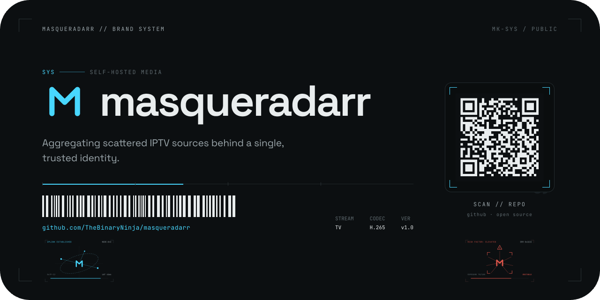
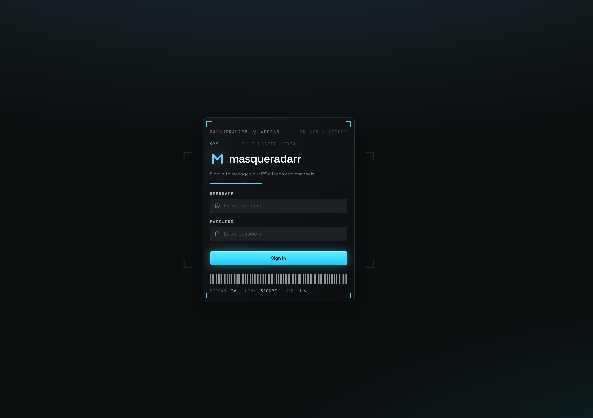
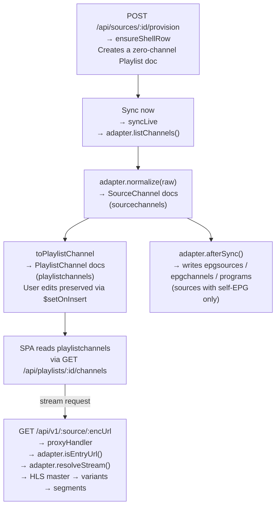
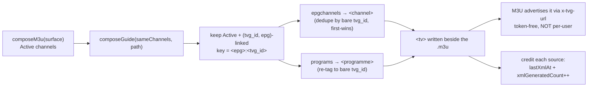
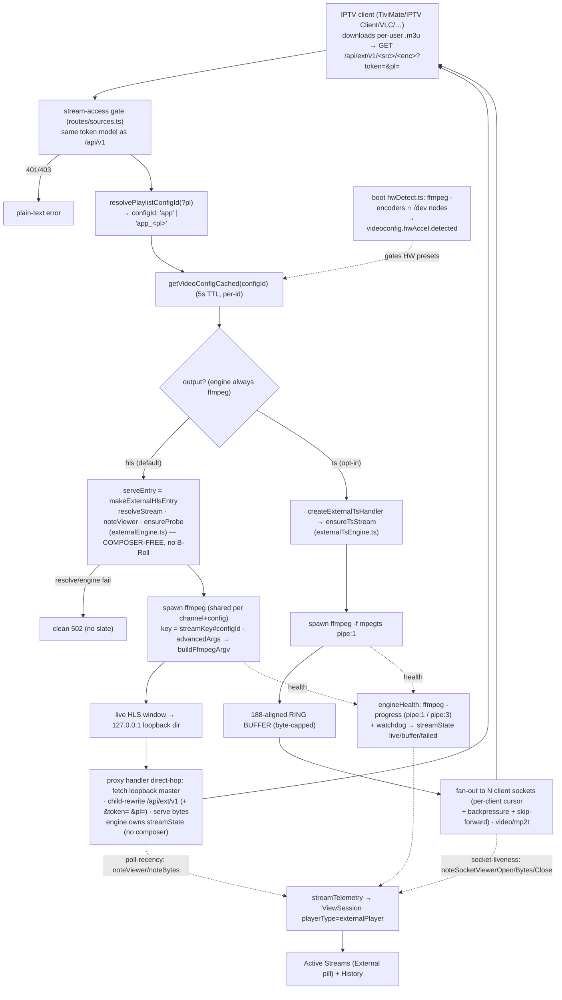

<div align="center">
  
  <p><em>Aggregating scattered IPTV sources behind a single, trusted identity.</em></p>
  <div style="display:flex; justify-content:center; align-items:center; gap:15px;">
    <a>
      
    </a>
    <a>
      
    </a>
    
    
  </div>
  <br />
  <div style="display:flex; justify-content:center; align-items:center; gap:15px;">
    <a href="https://github.com/TheBinaryNinja/masqueradarr/releases">
      
    </a>
    <a href="https://hub.docker.com/r/iflip721/masqueradarr">
      
    </a>
  </div>
  <br />
</div>

# What is `masqueradarr`
<div style="display:flex; justify-content:left; align-items:justify; gap:15px;">
    <a href="https://discord.gg/baD3HGpkcD">
      
    </a>
    <a>
      
    </a>
    
</div>

**masqueradarr** is a self-hosted IPTV aggregator. It pulls channel playlists (M3U) and guide
data (EPG/XMLTV) from a range of online IPTV services, normalizes them into one catalog, and
serves them back as a single, unified, standards-compliant playlist + guide — behind one trusted
identity that your media apps and IPTV clients can talk to.

It is the direct successor to **[TVApp2](https://github.com/TheBinaryNinja/tvapp2)**, which is now
**deprecated**. masqueradarr is not a fork or a patch — it is a ground-up re-architecture of the same
idea, carrying the project into the `*arr` self-hosted media family (Sonarr, Radarr, …) it's named for.

| Swag Pack | Location to full swag pack |
| --- | --- |
| 📦 Icon Pack | 🔗 [masqueradarr icon pack](/docs/icons/README.md) |
| 📦 Font Pack | 🔗 [masqueradarr font pack](/docs/font-packs/README.md) |
| 📦 Emblem-Sets | 🔗 [masqueradarr emblem-sets](/docs/emblem-sets/README.md) |
| 📦 Label-Sets | 🔗 [masqueradarr label-sets](/docs/label-sets/README.md) |



> [!NOTE] 
> View more [screenshots](/docs/img/screenshots) of the current system including the updated branding and layout.

# Evolution — **masqueradarr**

### Where it started: **TVApp2**

TVApp2 was a single, self-contained Docker container whose job was simple and effective: on a
schedule, **scrape a handful of IPTV providers** (TheTvApp, TVPass, MoveOnJoy), **download and
regenerate flat `.m3u` and `.xml` files**, and serve them over a small web interface so that
Jellyfin, Plex, or Emby could ingest them. It was a Node.js app on an **Alpine Linux** base,
supervised by **s6-overlay**, configured almost entirely through **environment variables**, with
HDHomeRun emulation and HD/SD quality toggles. It did one thing well — keep static playlists fresh.

That model had ceilings. Streams were **static URLs** baked into files, so anything behind a login,
a device check, an expiring token, or a rotating mirror couldn't be served. There was **no database**,
**no real UI** beyond file links, **no per-user access control**, **no live observability** of who was
watching what, and **no transcoding** for clients that couldn't play the upstream format. Every new
provider meant bespoke scraping glued into the core.

### Where it's going: masqueradarr

masqueradarr keeps the original promise — *aggregate scattered IPTV sources into one playlist + guide* —
and rebuilds everything underneath it to lift those ceilings:

- **Static files → a live, resolve-on-demand engine.** Instead of writing dead URLs to disk,
  masqueradarr resolves each stream **at play time** through an HLS proxy. That's what makes
  **authenticated** and **rotating** sources possible — e.g. an in-app, server-streamed Chromium
  captures a real login session, and per-play signed URLs are minted on demand.
- **Flat config → MongoDB + a real management SPA.** State lives in MongoDB; the front end is a
  **Vue 3 single-page app** with full screens for Dashboard, Active Streams, History / Metrics,
  Playlists, EPG Sources, Channel Mapping, Users, and Settings.
- **Bespoke scrapers → a source-agnostic adapter framework.** Adding a provider is one adapter file
  plus one registry line; the generic core (sync, proxy, B-Roll, telemetry) never branches per source.
- **File server → an API + two delivery surfaces.** An in-app player **and** an external-client
  engine that transcodes for TiviMate / VLC, with **GPU hardware acceleration** (NVENC / VAAPI / QSV).
- **Env-var toggles → users, roles & per-user access.** Real authentication (scrypt), session vs.
  stream tokens, and per-user tokenized playlist access.
- **Blind scheduling → live observability.** WebSocket-pushed viewer/bandwidth/buffering telemetry,
  ffprobe stream monitoring, a B-Roll placeholder slate while a channel buffers, and MongoDB-backed
  application logs.

## At a glance

| | **TVApp2** (deprecated) | **masqueradarr** |
|---|---|---|
| **Role** | Static M3U/XMLTV regenerator | Live IPTV aggregator + delivery platform |
| **Streams** | Static URLs written to files | Resolve-on-demand via HLS proxy |
| **State** | Flat files, no DB | MongoDB (Mongoose 8) |
| **Frontend** | Links to generated files | Vue 3 + Vite management SPA |
| **Backend** | Node.js scripts | Express 4 API (ESM, TypeScript) |
| **Sources** | Hard-coded scrapers (TheTvApp, TVPass, MoveOnJoy) | Pluggable adapters + URL / HDHomeRun / file imports |
| **Guide data** | One bundled XMLTV grabber | Gracenote, EPG-PW, Jesmann, Custom XMLTV + self-EPG |
| **Auth** | None | scrypt users, roles, per-user access lists |
| **Auth'd sources** | Not possible | Supported (streamed-login session capture) |
| **External clients** | Pass-through only | ffmpeg transcode engine, GPU HW accel |
| **Observability** | Logs | Live WS telemetry, history/metrics, ffprobe, system stats, app logs |
| **Backup** | None | Full-system gzip backup / restore + scheduled backups |
| **Base image** | Alpine + s6-overlay | Debian bookworm (glibc) + tini |
| **Config** | Environment variables | DB-backed settings + minimal `.env` bootstrap |

## Primary Architecture

masqueradarr is **two independently-built, independently-versioned npm packages** that the Docker
image stitches together — *not* a workspace, and they never import across the boundary:

- **`/` (root)** — the **Vue 3 + Vite SPA** (the management front end; `hls.js`, `vue-router`, `mitt`).
- **`server/`** — the **Express 4 + Mongoose 8 API** (ESM, TypeScript `strict`), which serves the
  built SPA, the `/api/*` REST surface, the HLS proxy + external-player engine, and five WebSockets
  (login-stream, stream-stats, logs-stream, probe-progress, system-stats).

Key subsystems:

- **Sources adapter framework** — a source-agnostic core (sync → normalize → dedupe → proxy) with
  per-provider adapters. Current sources: Pluggable adapters `<dynamix>`, proxy-only sources — **direct** (passes user-imported stream
  URLs straight through) and **hdhomerun** (remuxes a local tuner's MPEG-TS to HLS) — that back
  bring-your-own playlists.
- **Channel model** — a pristine synced reference (`sourcechannels`) projected into an editable,
  UI-facing store (`playlistchannels`); user edits survive re-syncs.
- **EPG + scheduler** — multiple guide ingesters behind one shared sync path — **Gracenote**,
  **EPG-PW**, **Jesmann**, and user-supplied **Custom XMLTV** (file upload or re-fetchable remote URL,
  streamed so multi-GB national guides parse with bounded memory) — plus the self-built guides that
  **built-in** carry. All driven by a `croner`-backed runtime scheduler over a persisted
  `cronjobs` collection.
- **Composition + export** — composes Global, per-user, and custom `.m3u` playlists with matching
  XMLTV guide siblings for downstream clients.
- **externalPlayer engine** — always-on ffmpeg transcode for third-party IPTV clients on a dedicated
  mount, with boot-time hardware-encoder detection.
- **Backup & maintenance** — full-system gzip backup / restore, scheduled backups, and Mongo
  index-rebuild / workspace-reset maintenance actions.

### Migration status

The rename and re-architecture are **in flight**. The codebase, brand, and runtime are masqueradarr;
the **published Docker repositories still carry the `tvapp2` names** (`iflip721/tvapp2-app-stack` for
the standard image, `iflip721/tvapp2` for the all-in-one) until the registry rename completes. If
you're coming from TVApp2: there is **no in-place upgrade path** — masqueradarr is a new application
with a new data model (MongoDB instead of flat files), so stand it up fresh and re-add your sources
through the UI.

### Lineage & credits

masqueradarr is the successor to **[TVApp2](https://github.com/TheBinaryNinja/tvapp2)** by
[TheBinaryNinja](https://github.com/TheBinaryNinja), and inherits its core aggregation framework
(ported from the sibling project). TVApp2 remains available, archived, and deprecated —
all new development happens here.

# Features

**Aggregation & delivery**

- Pulls **M3U playlists** and **EPG / XMLTV** guide data from multiple IPTV providers and normalizes
  them into one catalog.
- **Resolve-on-demand streaming** — each stream is resolved at play time through an HLS proxy (no dead
  URLs on disk), which is what makes **authenticated**, **token-gated**, and **rotating-mirror** sources
  possible.
- **Two delivery surfaces** — an in-app slide-out player and an external-client engine for TiviMate / VLC / Emby / Jellyfin / Plex.
- **Composition + export** — builds Global, per-user, and custom `.m3u` playlists, each with a matching
  XMLTV guide sibling advertised via `x-tvg-url`.

## Getting started

masqueradarr ships as Docker images. There are two deployment shapes.

### Option A — Compose stack (app + MongoDB)

1. Copy the env template and fill it in:

   ```bash
   cp .env.example .env
   ```

   At minimum set `MONGO_ROOT_USER` / `MONGO_ROOT_PASS`, your `DOMAIN`, and the host volume paths
   (`COMPOSE_PATH`, `BACKUPS_PATH`, `MONGO_DATA_PATH`) — each host dir must be writable by **uid 1000**
   (the container's `node` user). To publish on a host port other than `3000`, set `MASQUERADARR_PORT`
   (and update `DOMAIN` to match).

2. Bring it up:

   ```bash
   docker compose up -d
   ```

3. Open `http://localhost:3000` (or your `DOMAIN`; the host port reflects `MASQUERADARR_PORT`). The app
   **self-provisions** its `config.json` from the `.env` on every boot — there is no host config file to
   manage.

### Option B — All-in-one (single container)

A second image bundles **app + MongoDB + config bootstrap** into one container, so the whole stack runs
from a single `docker run` with no external database — ideal for a quick trial or a small home server. One
`/data` volume persists the database, exports, config, and credentials. See **Migration status** above for
the current published image name. *(On amd64, the bundled MongoDB 7.0 requires a CPU with AVX; on hosts
without it, use the compose stack.)*

To publish on a different host port, change the left side of the `-p` mapping — e.g. `-p 8080:3000`
(the container always serves on `3000` internally; `MASQUERADARR_PORT` only applies to the compose stack).

## First run

On first launch there are **no users** — the app reports `needsSetup` and the SPA walks you through
creating the **first admin account**. After that:

1. **Add a playlist** — the Add Playlist modal offers every built-in source plus custom playlists
   (clone / file / URL / HDHomeRun).
2. For an **authenticated** source (dulo), capture a login session from **Settings** (a server-streamed
   Chromium signs you in; only tokens are stored).
3. **Sync now** to populate channels, then optionally add **EPG Sources** and link guide data on the
   **Channel Mapping** screen.
4. Create **Users** with per-user access lists — each gets a personal **tokenized `.m3u` + XMLTV guide
   URL** for their IPTV client.

### Configuration

All runtime settings live in **MongoDB** and are editable on the **Settings** screen (domain, DNS
nameservers, video configuration, backups, …). The `.env` only **bootstraps infrastructure on first
boot**:

| Variable | Purpose |
|---|---|
| `MASQUERADARR_PORT` | Host port mapped to masqueradarr (default `3000`). |
| `MONGO_ROOT_USER` / `MONGO_ROOT_PASS` | MongoDB root credentials; also assemble the app's `mongoUri`. |
| `DOMAIN` | Public base URL written into composed playlist / guide links. |
| `DISPLAY_NAME` | App display name. |
| `TZ` | Container timezone (used by the scheduler). |
| `COMPOSE_PATH` | Host dir for composed `.m3u` + XMLTV exports (uid-1000 writable). |
| `BACKUPS_PATH` | Host dir for scheduled backups. |
| `MONGO_DATA_PATH` | Host dir for persistent MongoDB data. |
| `MONGO_HOST_PORT` | Host port mapped to mongod (default `27017`). |
| `MONGO_URI` / `MONGO_HOST` | Optional — point the app at an external / Atlas MongoDB instead of the compose `mongo` service. |
| `DNS_LOG_LEVEL` | Outbound-DNS trace verbosity (`1`–`3`); seeds the setting on first boot. |

> App-settings vars are seeded with `$setOnInsert` — they apply on the **first provision only**. Change
> them in the Settings UI afterward; a redeploy won't clobber UI changes.

> [!IMPORTANT]
> This sample enviornment variable is also included in the release notes and the `main` branch repository: `.env.example` \
> Ensure you update `COMPOSE_PATH` `BACKUPS_PATH` `MONGO_DATA_PATH` with the appropriate folders for your system. \
> \
> For the best experience, create each folder path assigned to `COMPOSE_PATH` `BACKUPS_PATH` `MONGO_DATA_PATH` before composing the docker stack. 
> ```bash
> mkdir compose && chown -R 1000:1000 ./compose && chmod -R 777 ./compose
> mkdir backups && chown -R 1000:1000 ./backups && chmod -R 777 ./backups
> mkdir mongo && chown -R 999:999 ./mongo && chmod -R 777 ./mongo
> ```

### Development

The repo is **two independently-built npm packages** (not a workspace):

```bash
# Frontend (repo root) — Vite dev server on :5173, proxies /api → http://localhost:3000
npm install && npm run dev

# Backend (server/) — tsx watch on :3000 (needs a reachable MongoDB)
cd server && npm install && npm run dev
```

There is **no test runner and no linter** — correctness is verified by `npm run build` (type-check) in
each package and by running the app.

# Pluggable sources

- A **source-agnostic adapter framework**: adding a provider is one adapter file plus one registry line;
  the generic core (sync → normalize → dedupe → proxy) never branches per source.

| Source | Mechanism |
| --- | --- |
| Distro TV | `makeFastSource` · jsrdn `tv_v5` catalog (Android-TV UA) · geo-qualified channel IDs · per-play double-underscore VAST macro expansion via `resolveStream` · distro.tv Origin/Referer-gated CDN · separate guide from `epg/query.php` |
| FreeLiveSports | `makeFastSource` · Unreel/PowR sports catalog · direct-HLS masters bearing Unreel VAST macros (`[DEVICE_ID]/[CB]/[REF]/[UA]/…`) · per-play macro expansion via `resolveStream` |
| LG Channels | `makeFastSource` · Public mirror via `schedulelist` (catalog + XMLTV guide in one call) · direct-HLS masters bearing `[DEVICE_ID]/[UA]/[NONCE]/…` VAST macros · per-play macro expansion via `resolveStream` |
| (**Local Now**) | Sentinel-resolve adapter · `localnow://<id>?slug=<slug>` stored at sync · resolves to a fresh signed CDN master per play · market-scoped channel set imported via `local/import.ts` · US-only (geo-gated) |
| Plex | _(planned)_ |
| DaddyLive | HTML catalog scraped from a runtime-selected rotating mirror (`mirrorDirectory.ts`) · `watch.php?id=<N>` entry sentinel · 3-hop, Referer-gated scrape per play to a fresh signed master · dynamic SSRF allow-set · self-EPG via schedule scrape + Gracenote crosswalk |
| Pluto TV | `makeFastSource` · sentinel+resolve · `/v2/guide/channels` catalog yields channel IDs only · stateful per-region boot session (`boot.pluto.tv`) · per-play JWT-stitched HLS master from the stitcher CDN |
| STIRR | `makeFastSource` · sentinel+resolve · `videos/list` catalog yields video IDs + provider-EPG pointers · per-play resolve via `POST /playable` · bundled provider guide |
| Samsung TV+ | `makeFastSource` · Public mirror (`i.mjh.nz`) · no auth · jmp2.uk short-link redirect followed per play to a rotating CDN master · dynamic SSRF allow-set learned at play time |
| TCL TV+ | `makeFastSource` · sentinel+resolve · `livetab → programlist` catalog via the ideonow.com gateway · per-play HLS master minted by a `format-stream-url` POST |
| Roku Channel | `makeFastSource` · sentinel+resolve · `/api/v2/epg` catalog yields channel IDs and metadata only · stateful Cloudflare-sensitive anonymous session · per-play JWT-signed HLS master from Roku's OSM CDN |
| Tubi TV | `window.__data` scrape of `/live` for channel catalog · per-channel EPG + short-lived JWT-signed HLS manifest from `/oz/epg/programming` · manifest minted per request (sentinel+resolve) · self-EPG written via `afterSync` |
| Vidaa Free TV | `makeFastSource` · direct-HLS (identity `resolveStream`) · client-config bootstrap (BOURL + tenant) · geo-qualified channel IDs · ad-DI macros stripped at catalog time |
| Vizio WatchFree+ | `makeFastSource` · direct-HLS (identity `resolveStream`) · public anonymous catalog from `watchfreeplus-epg-prod.smartcasttv.com` · ad-DI macro placeholders substituted with privacy-neutral values at normalize time |
| Whale TV+ | `makeFastSource` · macro-expansion · keyless auth bootstrap (apiToken → short-lived bearer) · Ottera/SSAI ad macros (`[did]/[session_id]/[cachebuster]/…`) expanded per play via `resolveStream` |
| Xumo Play | `makeFastSource` · sentinel+resolve · Valencia catalog yields channel IDs only · 3-hop per-play resolve (broadcast → asset → HLS source → macro-fill) |

## Custom playlists (bring your own)

- **Clone** — hand-pick channels from any synced source into a curated playlist; the channels are
  independent copies (so edits don't disturb the originals) but streams still route through the real adapter.
- **Import** — pull in any remote **M3U URL** (re-syncable), upload a static **`.m3u` file**, or expose a
  local **HDHomeRun** tuner (its raw MPEG-TS remuxed to HLS).
- Every custom playlist rides the same per-user, token-gated **`.m3u` + XMLTV** export machinery as the
  built-in sources.

## Local Now playlist

- Local Now ([localnow.com](https://localnow.com)) is a US-based FAST (Free Ad-Supported Streaming TV) service that delivers a **market-specific** lineup of live channels — local broadcast stations, regional news, and national FAST networks — curated by geographic television market. Masqueradarr integrates it as a fully managed, re-syncable custom playlist type with a bundled EPG guide.

> [!NOTE] 
> **US-only.** Local Now is geo-gated to US IP addresses. Attempting to add a Local Now playlist from a non-US IP will return a clear error. No VPN workaround is built in; route the server through a US network to use this feature.

### _Local Now_ : City / Market Lookup

When adding a Local Now playlist you choose a **city/market** — the geographic unit Local Now uses to select a channel lineup. Masqueradarr exposes two ways to pick one:

| Method | How it works |
|--------|-------------|
| **City search** | Type at least 2 characters in the city field. A typeahead calls `GET /api/import/local/cities?q=` which queries Local Now's `City/Search` API and returns matching cities with their market identity. |
| **Auto-detect** | Click "Use my detected market." The server reads the geo-detected market from Local Now's own homepage response and pre-fills the closest market to the server's public IP. Falls back to New York City if the homepage carries no geo signal. |

### _Local Now_ : DMA and Market — what they are

Every choice resolves to two stored identifiers:

| Field | What it is | Example |
|-------|-----------|---------|
| **DMA** (`marketDma`) | A numeric [Designated Market Area](https://en.wikipedia.org/wiki/Media_market) code — the Nielsen/TV-industry identifier for a regional television market. | `501` (New York) |
| **Market** (`marketSlug`) | A comma-joined list of Local Now market slugs — a primary city slug plus any associated PBS station slugs for that market. | `nyNewYorkCity,pbs-wnet,pbs-wedh,pbs-wliw,pbs-wnjt` |

Both are stored on the playlist row and are used together as the query parameters for every upstream catalog/guide fetch. They are set once at creation and never modified afterward (to change market, delete the playlist and create a new one).

### _Local Now_ : What the Playlist Provides

When you add a Local Now playlist, Masqueradarr:

1. **Creates a custom playlist row** (`source: 'local'`, `endpoint: 'custom'`) with the market's DMA and slug stored directly on the playlist.
2. **Immediately syncs the market's channel lineup** from Local Now's combined catalog + guide endpoint. Channels appear in the playlist the moment creation completes.
3. **Prunes subscription-locked channels** — any channel with `subscription_access.unlocked === false` is excluded; only freely available content is imported.
4. **Deduplicates** the raw channel list by channel ID before writing.

### _Local Now_ : Channel fields

Each imported channel carries:

| Field | Value |
|-------|-------|
| Name | The channel's display name from Local Now |
| Group | `Local News` for local broadcast stations (identified by W/K call signs, `My City` genre, `hyperlocal`/`epg-local-now` slugs), otherwise the first IAB genre tag, otherwise `Local` |
| Channel number | The broadcast channel number when provided by Local Now |
| Logo | The channel's logo URL from Local Now |
| Stream entry | An opaque `localnow://<id>?slug=<slug>` sentinel — streams are **resolved on demand** per play via Local Now's DSP backend, not stored as static URLs |

### _Local Now_ : What the EPG Source Provides

Each Local Now playlist automatically creates and owns a **playlist-bound EPG source** (visible in the EPG Sources screen, labeled `<Market> — Local Now`). Key properties:

| Property | Value |
|----------|-------|
| Source | `local` |
| Binding | Playlist-bound (`playlistBinding: true`) — manual sync and schedule controls are hidden in the EPG Sources UI; the **playlist's hourly cronjob** drives all refreshes |
| Guide data | Inline `program[]` from the market's catalog fetch — no separate EPG call needed |
| Guide window | ~5 programs per channel per sync (continuous coverage maintained by the hourly schedule) |
| Program fields | Title, start/end times, description, content rating, season/episode numbers (parsed from Local Now's composite title format), IAB category |
| Channel linking | Channels are **self-linked** automatically at sync time — no manual Channel Mapping required. Each channel's `tvg_id` and `epg` fields are set to point at this EPG source on first sync, so the guide renders immediately |

The EPG source ID matches the playlist ID — they are a matched pair scoped to the same market. Deleting the playlist cascade-deletes the EPG source, all guide channels, all programs, and the hourly cronjob together.

### _Local Now_ : Adding Multiple Local Now Playlists (Different Markets)

You can add as many Local Now playlists as you want, **one per city/market**. Each is fully independent:

| Aspect | Behavior |
|--------|----------|
| **Playlist row** | A separate `playlists` document per market, with its own `id`, `marketDma`, `marketSlug`, and `marketLabel` |
| **Channel storage** | Each market's channels are stored under their own playlist ID — there is no sharing or collision between markets |
| **EPG source** | Each market gets its own `EpgSource` (id = playlist id), its own `epgchannels`, and its own `programs` collection scope |
| **Schedule** | Each market gets its own independent hourly `Cronjob` |
| **Naming** | Masqueradarr disambiguates playlist IDs automatically — if you add "New York" twice the second gets a numeric suffix (`newYork2`) |
| **Deletion** | Deleting one market's playlist removes only that market's channels, EPG, and schedule — the others are unaffected |

**Example:** adding New York (DMA 501) and Los Angeles (DMA 803) gives you two separate playlists (`newYork` and `losAngeles`), two separate EPG sources, and two independent hourly schedules. Each can be assigned to different users via the standard playlist access controls.

## Guide data (EPG)

- Ingests guide data from **Gracenote**, **EPG-PW**, **Jesmann** (guided picker), and any **Custom XMLTV**
  source — an uploaded file or a re-fetchable remote URL, streamed so multi-GB national guides parse with
  bounded memory — plus the self-built guides that **playlist-bound** carry.
- **Channel Mapping** links channels to guide data with composite match-scoring and many-to-one EPG
  linking; the link survives re-syncs.

**Management SPA** (Vue 3)

- Full screens for **Dashboard, Active Streams, History / Metrics, Playlists, EPG Sources, Channel
  Mapping, Users,** and **Settings**.
- An editable channel store where **user edits survive re-syncs**, and shared progress modals for the
  long-running sync / compose operations.

**Users & access control**

- **scrypt** authentication, **admin / user** roles, and **per-user access lists** (allowed playlists /
  custom playlists).
- A session-token vs. stream-token split, and per-user **tokenized M3U access** (token-free download,
  token-gated stream).

**Observability**

- WebSocket-pushed **viewer / bandwidth / buffering telemetry** and **ffprobe** stream monitoring.
- Live **system-performance** push (CPU / memory / GPU) on the Dashboard, including per-vendor GPU usage.
- Persisted **view-session history** + per-user metrics, and **MongoDB-backed application logs** (12
  categories, 14-day TTL) with a live log drawer.
- A **B-Roll placeholder slate** burned into real HLS while an in-app channel is establishing or
  re-buffering — so even headless clients see something.

**Transcoding**

- An always-on per-playlist **ffmpeg engine** for external clients — **loopback-HLS** (default) or
  **raw MPEG-TS** output.
- Multi-vendor **GPU hardware acceleration** (NVENC / VAAPI / QSV) with boot-time encoder detection, so
  the UI only offers what the host can actually do.

**Scheduling**

- A `croner`-backed runtime scheduler over a persisted `cronjobs` collection: playlist re-sync, EPG
  re-sync, M3U / XMLTV recompose, and scheduled backups.

**Backup & restore**

- One-click **full-system backup** — a gzipped snapshot of every collection, downloaded or written to a
  configured backup directory on a schedule.
- **Restore** from an uploaded backup or a saved file; the restore re-orchestrates the dependent
  subsystems (boot init, DNS, scheduler) in place.
- **Maintenance** actions from Settings: rebuild MongoDB indexes, or reset the workspace (wipe content,
  keep users / settings).

# Channel Adapter Architecture : _Pluggable sources_

All adapters implement the `SourceAdapter` contract (`server/src/sources/types.ts`) and are registered in `server/src/sources/registry.ts`. The generic core (`buildSource`, `proxyHandler`) never branches per source — every per-source difference is encapsulated in the adapter object.

> [!NOTE]
> Expand _Channel Adapter Architecture : Flowchart_ to view the visual diagram

```mermaid
flowchart LR
    REG["registry.ts\nSOURCES: SourceAdapter[]"]

    REG --> SYN["Synthetic\nproxy-only · no catalog · synthetic: true\nboot init skips shell row · manifest omits"]
    REG --> BIN["Built-in\nsyncable catalog · shell row on demand\nProvision → Sync now → playlistchannels"]

    %% ── Synthetic ──────────────────────────────────────────────
    SYN --> DIRECT["direct\n'Imported'\nPassthrough for user-imported M3U URLs\nidentity resolveStream · any https allowed\nno shell row · channels carry origin:'direct'"]
    SYN --> HDHOMERUN["hdhomerun\n'HDHomeRun'\nLocal OTA/cable tuner\nDevice TS URL → ffmpeg remux → loopback HLS\nSSRF gate: loopback only\nno shell row · channels carry origin:'hdhomerun'"]
    SYN --> LOCAL["local\n'Local Now'\nlocalnow://id?slug sentinel\nresolveStream → rotating CDN master\ndynamic SSRF allow · no shell row\nchannels carry origin:'local'"]

    %% ── Built-in ────────────────────────────────────────────────
    BIN --> AUTH["Authenticated\nrequiresAuth: true"]
    BIN --> ANON["Anonymous\nno auth surface"]

    %% ── Authenticated ───────────────────────────────────────────
    AUTH --> DULO["dulo\n'dulo.tv'\nSupabase session + device fingerprint\nCapture via headful Chromium (DuloLoginDrawer)\ndulo://channel/id sentinel\nresolveStream → fresh playbackUrl per play\nSSRF: dynamic allow (learned hosts)\nEPG: Gracenote crosswalk only\n(no self-EPG)"]

    %% ── Anonymous ───────────────────────────────────────────────
    ANON --> SCRAPE["Scrape-based\ncatalog from HTML/rotating mirror\nresolution via multi-hop scrape"]
    ANON --> APISENTINEL["API Sentinel\ncatalog from JSON API\nstorage: opaque sentinel URL\nresolution: API call per play"]
    ANON --> MACROFILL["Macro-fill\ncatalog from JSON API\nstorage: HLS URL with __MACRO__ slots\nresolution: fill macros per play"]
    ANON --> IDENTITY["Identity / Direct\ncatalog carries real HLS master\nresolveStream: pre-allow host only"]

    %% ── Scrape-based ────────────────────────────────────────────
    SCRAPE --> DLHD["dlhd\n'DaddyLive'\nCatalog: scraped rotating mirror HTML directory\nwatch.php?id=id sentinel\nresolveStream: 3-hop Referer-gated scrape\nSSRF: dynamic allow · segments disguised as image/pdf\nEPG: Gracenote crosswalk + self-EPG (afterSync)\ndefaultDisabled: 18+ channels"]
    SCRAPE --> DAMI["dami\n'Dami.TV'\nDlhd-derived — reuses dlhd resolveStream + mirror\nOwn catalog (~878 ch, logos, ISO country grouping)\nfrom /papi/api/streams\nEPG: Gracenote crosswalk + self-EPG (afterSync)\nHard-depends on dlhd leaves"]

    %% ── API Sentinel ────────────────────────────────────────────
    APISENTINEL --> TUBI["tubi\n'Tubi.TV'\ntubi://channel/id sentinel\nresolveStream: Tubi API per play\nSSRF: dynamic allow\nEPG: inline self-EPG (afterSync)\nprograms[] carried on raw catalog rows"]
    APISENTINEL --> XUMO["xumo\n'Xumo Play'\nbroadcast.json URL sentinel\nresolveStream: 3-hop API resolve per play\nSSRF: dynamic allow\nEPG: paginated market guide (afterSync)"]
    APISENTINEL --> STIRR["stirr\n'STIRR'\n/playable URL sentinel (video id in path)\nresolveStream: 1-hop POST /playable per play\nSSRF: dynamic allow\nEPG: two-tier per-channel guide (afterSync)"]
    APISENTINEL --> TCL["tcl\n'TCL TV+'\nformat-stream-url?... sentinel\nresolveStream: 1-hop POST per play\nSSRF: dynamic allow\nEPG: category schedule + batched detail (afterSync)"]
    APISENTINEL --> PLUTO["pluto\n'Pluto TV'\npluto://region/id sentinel\nresolveStream: region boot (cached) + URL construct\nSSRF: dynamic allow\nEPG: per-region timelines guide (afterSync)\nGracenote crosswalk wired"]
    APISENTINEL --> ROKU["roku\n'The Roku Channel'\nroku://id sentinel\nresolveStream: session boot (cached) + playId resolve\nSSRF: dynamic allow\nEPG: content-proxy fanout guide (afterSync)"]

    %% ── Macro-fill ──────────────────────────────────────────────
    MACROFILL --> SAMSUNG["samsung\n'Samsung TV Plus'\njmp2.uk redirect → CDN master\nresolveStream: follow redirect per play\nSSRF: dynamic allow\nEPG: self-EPG (afterSync)\nGracenote crosswalk wired"]
    MACROFILL --> LG["lg\n'LG Channels'\nHLS URL with {MACRO} slots\nresolveStream: macro expand per play\nSSRF: dynamic allow\nEPG: inline program self-EPG (afterSync)"]
    MACROFILL --> WHALE["whale\n'Whale TV+'\nHLS URL with macro slots\nresolveStream: macro fill per play\nSSRF: dynamic allow\nEPG: separate /epg fetch (afterSync, Vidaa shape)"]
    MACROFILL --> DISTRO["distro\n'Distro TV'\nHLS URL with __MACRO__ VAST slots\nresolveStream: macro fill per play\nSSRF: dynamic allow\nEPG: tvg_id-keyed self-EPG (afterSync)"]
    MACROFILL --> FLS["freelivesports\n'FreeLiveSports'\nHLS URL with device/cb/ref macro slots\nresolveStream: macro fill per play\nSSRF: dynamic allow\nEPG: inline program self-EPG (afterSync)"]

    %% ── Identity / Direct ───────────────────────────────────────
    IDENTITY --> VIZIO["vizio\n'Vizio WatchFree+'\ncatalog: channelUrls[0] IS the real HLS master\nresolveStream: identity + pre-allow host\nSSRF: dynamic allow\nEPG: separate /api/airings schedule (afterSync)"]
    IDENTITY --> VIDAA["vidaa\n'Vidaa Free TV'\ncatalog: macros already expanded at catalog time\nresolveStream: identity + pre-allow host\nSSRF: dynamic allow\nEPG: self-EPG via uid (afterSync)\nGracenote crosswalk wired"]

    %% ── Styling ─────────────────────────────────────────────────
    classDef synthetic fill:#2d2d3a,stroke:#7c7cad,color:#c8c8e8
    classDef auth fill:#3a2020,stroke:#ad4040,color:#e8c8c8
    classDef scrape fill:#1e2d1e,stroke:#4a8c4a,color:#c8e8c8
    classDef sentinel fill:#1e2535,stroke:#4a7cad,color:#c8d8e8
    classDef macro fill:#2d2020,stroke:#8c6a30,color:#e8d8b0
    classDef identity fill:#252525,stroke:#666,color:#ccc
    classDef group fill:#1a1a2a,stroke:#555,color:#aaa
    classDef registry fill:#111,stroke:#888,color:#fff,font-weight:bold

    class REG registry
    class SYN,BIN,AUTH,ANON,SCRAPE,APISENTINEL,MACROFILL,IDENTITY group
    class DIRECT,HDHOMERUN,LOCAL synthetic
    class DULO auth
    class DLHD,DAMI scrape
    class TUBI,XUMO,STIRR,TCL,PLUTO,ROKU sentinel
    class SAMSUNG,LG,WHALE,DISTRO,FLS macro
    class VIZIO,VIDAA identity
```

<details>
  <summary><strong>Channel Adapter Architecture : Flowchart</strong></summary>


</details>

## Key Properties Summary

| Adapter | Label | Auth | Resolve Strategy | Self-EPG | Gracenote XWalk |
|---------|-------|------|-----------------|----------|-----------------|
| `direct` | Imported | — | Identity (passthrough) | — | — |
| `hdhomerun` | HDHomeRun | — | ffmpeg remux → loopback HLS | — | — |
| `local` | Local Now | — | Sentinel → rotating CDN | — | — |
| `dulo` | dulo.tv | session | `dulo://` sentinel → playbackUrl | — | yes |
| `dlhd` | DaddyLive | — | `watch.php` → 3-hop scrape | yes | yes |
| `dami` | Dami.TV | — | dlhd resolveStream (shared) | yes | yes |
| `tubi` | Tubi.TV | — | `tubi://` → Tubi API | yes (inline) | — |
| `xumo` | Xumo Play | — | broadcast.json → 3-hop API | yes | — |
| `stirr` | STIRR | — | `/playable` → 1-hop POST | yes | — |
| `tcl` | TCL TV+ | — | `format-stream-url` → 1-hop POST | yes | — |
| `pluto` | Pluto TV | — | `pluto://` → region boot + URL | yes | yes (wired) |
| `roku` | The Roku Channel | — | `roku://` → session + playId | yes | — |
| `samsung` | Samsung TV Plus | — | jmp2.uk redirect | yes | yes (wired) |
| `lg` | LG Channels | — | `{MACRO}` fill per play | yes | — |
| `whale` | Whale TV+ | — | macro fill per play | yes | — |
| `distro` | Distro TV | — | `__MACRO__` fill per play | yes | — |
| `freelivesports` | FreeLiveSports | — | macro fill per play | yes | — |
| `vizio` | Vizio WatchFree+ | — | Identity (direct HLS master) | yes (airings) | — |
| `vidaa` | Vidaa Free TV | — | Identity (macros pre-expanded) | yes | yes (wired) |

## Lifecycle: how a built-in source reaches the UI



# Playlists

> **Scope:** the playlist data model — what a playlist *is*, the built-in vs. custom kinds, how guide
> data binds to it, and how per-user access is granted. The catalog (`playlistchannels`) and the export
> surface (`.m3u` + XMLTV guide sibling) meet here.

## How Playlists work

A **Playlist** is a row in the `playlists` collection — the *envelope* (name, hosted URL, endpoint mode,
schedule, state). Its **channels live separately** in `playlistchannels`, queried by the playlist's
`source` (or clone) id. A playlist row with no channels is a valid, paused shell.

- **Two channel stores back every playlist.** A sync writes a pristine, source-of-truth `sourcechannels`
  reference, then projects it into the editable, UI-facing `playlistchannels`. You edit the latter (rename,
  disable, channel #, EPG link) and your edits **survive a re-sync**: a sync `$set`s source-derived fields,
  `$setOnInsert`s the user-editable ones, and prunes channels that vanished upstream.
- **Hosted URL + endpoint mode.** A `global`-endpoint playlist is served through the one consolidated Global
  M3U endpoint; a `custom`-endpoint playlist is served at its own path. The `url` ("HOSTED AT") always
  prepends `settings.domain`, so changing the domain in **Settings cascades** to every playlist's URL.
- **State + schedule.** `state:false` pauses the endpoint (downstream clients get a 404). `interval` + `auto`
  drive the scheduler; a manual **Sync now** is always available.
- **Streaming is resolve-on-demand.** A channel's stream URL is *derived* (`/api/v1/<source>/<enc-entry>`),
  never stored, so the proxy resolves the real upstream at play time. Every channel keeps an `origin` source,
  so a cloned or imported channel still routes through the right adapter.

## What kinds of playlists are possible

| Kind | `source` tag | Created via | Channels |
|---|---|---|---|
| **(Default) source playlist** | `<dynamic>` | Add Playlist → **Built-In** (provisions a zero-channel shell; populates on first **Sync now**) | Synced from the adapter; `id === source` |
| **Clone** | `clone` | Add Playlist → **Clone** — hand-pick channels from any synced source | Independent COPIES in `playlistchannels`; `origin` = the provider source for routing |
| **URL import** | `url` | Add Playlist → **URL** — fetch a remote `.m3u` / `.m3u8` | Parsed from the upstream; re-syncable via the stored `remoteUrl` |
| **File upload** | `file` | Add Playlist → **File** — upload a static `.m3u` | Parsed once from the uploaded file |
| **HDHomeRun** | `hdhomerun` | Add Playlist → **HDHomeRun** — point at a LAN tuner (`deviceUrl`) | Discovered from the device; raw MPEG-TS remuxed to HLS, capped at the tuner count |

Built-in defaults are **Global-endpoint** by default; the custom kinds are **Custom-endpoint** and ride the
per-playlist export machinery (their own path + guide sibling). All the type tags (`clone`/`file`/`url`/
`hdhomerun`) and modes (`global`/`custom`) are stored **lowercase**.

## Playlists + EPG Sources with Playlist Binding

Guide data reaches a playlist through **two distinct mechanisms** — keep them separate:

1. **Channel-level guide linking (the everyday case).** EPG attaches to a playlist through its *channels*,
   not the playlist row. Each channel carries a 2-factor **`(tvg_id, epg)`** link — set on the **Channel
   Mapping** screen (or self-linked by sources that ship their own EPG). At compose time the guide is built
   from exactly the channels that carry a link, so "which EPG sources feed this playlist" is simply
   *whichever sources its channels are mapped to* — many sources can contribute to one playlist's guide.
2. **Playlist-bound EPG sources (`playlistBinding`). **Built-in** carry their *own* inline guide.
   When you sync such a playlist, its `afterSync` hook writes the guide **and** upserts a matching EPG source
   row flagged **`playlistBinding: true`**, then self-links the playlist's channels to it. These rows are
   *owned by the playlist's sync* — the playlist drives their refresh cadence, so the EPG Sources screen
   hides their manual-sync + schedule controls. You never add or schedule them by hand.

## Assigning Playlist access to users

- Access is a **per-user allow-list**, split to mirror the endpoint modes: `allowedPlaylists`
  (Global-endpoint playlists) and `allowedCustomPlaylists` (Custom-endpoint playlists).
- You assign membership on the **Playlists screen** (per playlist — it was moved here off the Users screen),
  not by editing the user.
- **Admins ⇒ every playlist.** An admin account's allow-lists are *materialized* to hold every playlist id
  (a real invariant, not just a role bypass), and creating a new playlist auto-grants it to all admins — so
  an admin always sees the full catalog.
- Each user gets a personal, **tokenized** `.m3u` + XMLTV guide URL for their IPTV client: the **download is
  token-free**, but the **stream is token-gated** to that user's allowed playlists.

---

# EPG Sources

> **Scope:** the guide-data subsystem — what an EPG source *is*, the provider kinds, the one shared sync
> path, how playlist-bound self-EPG differs, and how guide data is woven into a playlist's `.m3u` at
> compose time. The XMLTV wire format itself is the sibling of the M3U export.

## How EPG Sources work

An **EPG source** is a row in `epgsources` registering one guide provider. A sync writes two collections:
**`epgchannels`** (one row per guide channel) and **`programs`** (the airings), both keyed by a composite
**`<epg>:<tvg_id>`** id so multiple sources never collide.

- **One shared sync path.** Every kind goes through `syncEpgSource.ts`, whether triggered by a manual
  **Sync now** or by a scheduler tick; it maintains the per-source `syncSuccessCount` / `syncFailCount` and
  `status`.
- **A sync is a per-source replace.** The source's old channels/programs are swapped for the fresh pull. The
  streaming-XMLTV path replaces up-front, so a mid-stream failure marks the source `error` and the next good
  sync heals it cleanly (the shared `epgchannels`/`programs` collections are scoped by `source`).
- **Reorder + run-stats.** The EPG Sources screen is drag-to-reorder (`order`); the guide-generation
  run-stats (`lastXmlAt`, `xmlGeneratedCount`, `xmlFailCount`) are credited during compose (below).

## What kinds of EPG Sources are possible

The `source` discriminator (stored lowercase):

| Kind | Added via | Notes |
|---|---|---|
| **gracenote** | Add EPG Source → **Gracenote** | Provider/lineup grid; provenance fields (headend / lineup / postal / country / …) let the grid URL be rebuilt + re-synced |
| **epg-pw** | Add EPG Source → **EPG-PW** | epg.pw per-channel XML |
| **jesmann** | Add EPG Source → **Jesmann** (guided picker) | Large national XMLTV guides, **streamed** so multi-GB files parse with bounded memory |
| **xml file** | Add EPG Source → **Custom** (upload) | One-shot uploaded XMLTV document |
| **remote url** | Add EPG Source → **Custom** (URL) | Re-fetchable remote XMLTV URL (streamed, gzip-aware) |
| **playlist-bound** | *(automatic)* — the playlist's `afterSync` binding | **Playlist-bound** self-EPG (`playlistBinding:true`); not user-added |

## EPG Sources with a Playlist Binding + the syncing process

- **Standalone sources** (gracenote / epg-pw / jesmann / custom XMLTV) sync on demand or on a `cronjobs`
  schedule, independent of any playlist.
- **Playlist-bound sources** (built-in) have **no manual sync of their own.** They are written by the
  *playlist's* `afterSync` hook off the same listing that playlist sync already fetched, and the bound source
  row is re-asserted (`playlistBinding:true`) on every playlist sync. To refresh a bound guide you **sync its
  playlist** — the EPG Sources screen deliberately hides their sync/schedule controls because the playlist
  owns the cadence.
- Either way, the *binding between guide data and a playlist's channels* is the channel-level
  **`(tvg_id, epg)`** link — Channel Mapping for user-added sources, self-linked for channel-adapter built-in sources.

## How EPG Sources are ingested into playlists during a compose

Guide data only reaches a downstream client at **compose** time, and composition is **playlist-scoped**: a
guide is written as a **sibling of the M3U** by `composeGuide()`, which runs off the *same Active channel set*
`composeM3u()` just wrote (the Global union, or one Custom playlist) — so a guide can never drift from its M3U.



Per composed surface:

1. **Select** — keep only **Active** channels that carry a 2-factor **`(tvg_id, epg)`** link; index them by
   the composite key `<epg>:<tvg_id>`.
2. **Channels** — resolve each key's `epgchannels` row (display-name / call-sign / channel-no) and emit one
   `<channel>`, **de-duped by the bare `tvg_id`** (first-wins — two sources can publish the same id and a
   player can't disambiguate anyway). A channel linked to an `epgchannels` row that isn't synced yet is
   skipped, never orphaned.
3. **Programmes** — pull the `programs` for those keys and emit `<programme>`s, **re-tagged to the bare
   `tvg_id`** so each airing matches its `<channel id>`.
4. **Merge + advertise** — the result merges programme data from **every EPG source the playlist's channels
   link to** into one `<tv>` document written next to the `.m3u`, advertised via **`x-tvg-url`**. The guide is
   **token-free** and **not per-user** (a superset of any one user's channels is harmless).
5. **Credit** — every contributing source gets `lastXmlAt` + `xmlGeneratedCount++` (or `xmlFailCount++` on
   failure).

# Video Engine

> **Scope:** how a stream session opened by a **IPTV client** (TiviMate, IPTV Client, VLC, UHF, IPTV One,
> ffmpeg-tier players) is served and made observable — the **externalPlayer** path. This is the engine half of
> the appPlayer / externalPlayer split (the "robust-donut" rollout); its sibling is the in-app slide-out player.
> This doc traces only what is externalPlayer-specific.
>
> **One-line:** external clients subscribe to a per-user `.m3u` whose channel URLs are the **`/api/ext/v1`**
> mount (the M3U composer writes them, carrying `&pl=<owningPlaylistId>` so the per-playlist config is selectable).
> The external HLS path is **composer-free + engine-driven** — there is **no B-Roll slate** on external (that's the
> in-app `/api/v1` path only). Every session is **always** routed through a shared per-channel **ffmpeg** process
> (configured in **Settings → Video Configuration**) that transcodes/normalizes **and** captures
> loading/buffering/failed health for an otherwise-opaque client — output as **loopback HLS** (default) or an
> opt-in **raw MPEG-TS socket**. ffmpeg is the single, always-on external engine (no engine selector, no
> enable/disable toggle, no direct-relay bypass); a resolve/engine failure is a clean error (**502**), not a slate.

## Plain language

A TiviMate/IPTV Client/VLC user downloads their personal playlist file from TVApp2 and the app plays its channels.
Those channels point at a special server URL (`/api/ext/...`) that TVApp2 writes specifically for outside
apps. The problem this solves: an outside app is a **black box** — it never tells the server "I'm buffering" or
"this failed," and it may need a different video format than the source provides.

So TVApp2 puts a **media engine** (ffmpeg) in the middle of every external session. The engine pulls the channel
once, optionally re-encodes it to something every player accepts, and — crucially — **watches its own health**
(is it keeping up? did it stall? did it die?) so the server can show that session's state on the **Active
Streams** and **History** screens, exactly like an in-app session. One engine process is shared by everyone
watching that channel.

Unlike the in-app player, the external path does **not** show the broadcast-style "holding card" (B-Roll) while
a channel is starting up or failing — an outside app supplies its own loading/error UI, so the server just hands
over the stream and, if it can't, returns a clean error (the in-app player keeps the slate). There are two ways
to hand the bytes over:

- **HLS (default)** — the engine writes a normal HLS stream the server already knows how to serve and count.
  Works for almost every modern client (TiviMate, IPTV Client, VLC, Emby). The server fetches the engine's output and
  rewrites/serves it through the same proxy plumbing the in-app path uses — but **without** the B-Roll composer.
- **Raw TS (opt-in)** — the classic "IPTV link": one long-held connection streaming MPEG-TS, for older
  raw-only clients. This needs its own connection-counting because such a client never re-polls.

If GPU hardware is present, the engine can offload re-encoding to it (NVENC / Intel QSV / VAAPI); the server
detects what's usable at startup so the Settings screen only offers real options. The default preset is a
near-passthrough remux (`-c copy`), so the always-on engine adds little CPU for a source that's already
browser-safe.

> [!NOTE]
> Expand _Video Engine : Graph_ to view the visual diagram

<details>
  <summary>Video Engine : Graph</summary>


</details>