# 📄 Guides and Docs ⮕ [Start Here](https://thebinaryninja.github.io/masqueradarr/)

<div align="center">
  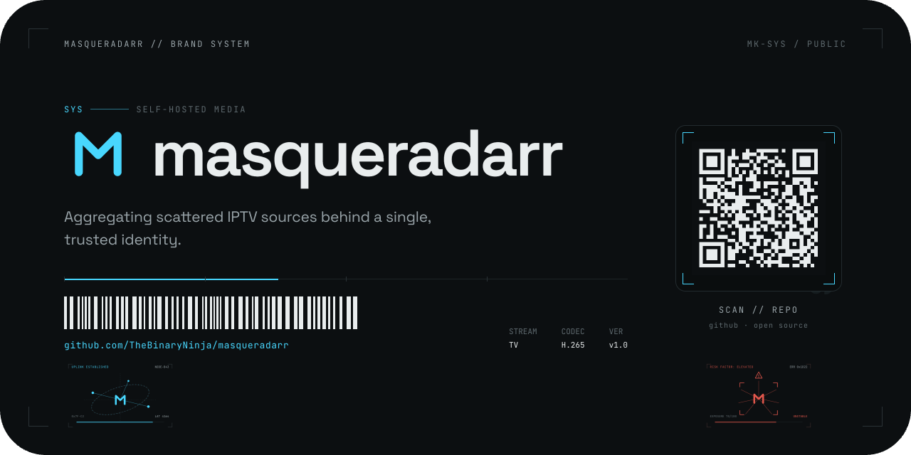
  <p><em>Aggregating scattered IPTV sources behind a single, trusted identity.</em></p>
  <div style="display:flex; justify-content:center; align-items:center; gap:15px;">
    <a>
      
    </a>
    <a>
      
    </a>
    
    
  </div>
  <br />
  <div style="display:flex; justify-content:center; align-items:center; gap:15px;">
    <a href="https://github.com/TheBinaryNinja/masqueradarr/releases">
      
    </a>
    <a href="https://hub.docker.com/r/iflip721/masqueradarr">
      
    </a>
  </div>
  <br />
</div>

# What is `masqueradarr`

### **DISCORD** is the fastest way to find out exactly what is happening with this project. Tons of updates happening from community input.

<div style="display:flex; justify-content:left; align-items:justify; gap:15px;">
    <a href="https://discord.gg/baD3HGpkcD">
      
    </a>
    <a>
      
    </a>
</div>

### [masqueradarr](https://thebinaryninja.github.io/masqueradarr/) : Guides : Explanations : Documentation

**masqueradarr** is a self-hosted IPTV aggregator. It pulls channel playlists (M3U) and guide
data (EPG/XMLTV) from a range of online IPTV services, normalizes them into one catalog, and
serves them back as a single, unified, standards-compliant playlist + guide — behind one trusted
identity that your media apps and IPTV clients can talk to.

It is the direct successor to **[TVApp2](https://github.com/TheBinaryNinja/tvapp2)**, which is now
**deprecated**. masqueradarr is not a fork or a patch — it is a ground-up re-architecture of the same
idea, carrying the project into the `*arr` self-hosted media family (Sonarr, Radarr, …) it's named for.

| Swag Pack | Location to full swag pack |
| --- | --- |
| 📦 Icon Pack | 🔗 [masqueradarr icon pack](/docs/icons/README.md) |
| 📦 Font Pack | 🔗 [masqueradarr font pack](/docs/font-packs/README.md) |
| 📦 Emblem-Sets | 🔗 [masqueradarr emblem-sets](/docs/emblem-sets/README.md) |
| 📦 Label-Sets | 🔗 [masqueradarr label-sets](/docs/label-sets/README.md) |

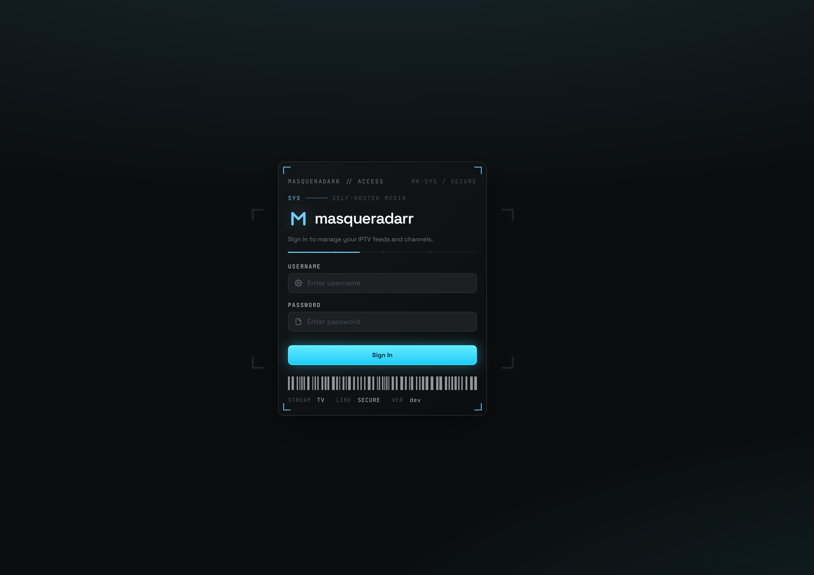

> [!NOTE] 
> View more [screenshots](/docs/img/screenshots) of the current system including the updated branding and layout.

# Evolution — **masqueradarr**

### Where it started: **TVApp2**

TVApp2 was a single, self-contained Docker container whose job was simple and effective: on a
schedule, **scrape a handful of IPTV providers** (TheTvApp, TVPass, MoveOnJoy), **download and
regenerate flat `.m3u` and `.xml` files**, and serve them over a small web interface so that
Jellyfin, Plex, or Emby could ingest them. It was a Node.js app on an **Alpine Linux** base,
supervised by **s6-overlay**, configured almost entirely through **environment variables**, with
HDHomeRun emulation and HD/SD quality toggles. It did one thing well — keep static playlists fresh.

That model had ceilings. Streams were **static URLs** baked into files, so anything behind a login,
a device check, an expiring token, or a rotating mirror couldn't be served. There was **no database**,
**no real UI** beyond file links, **no per-user access control**, **no live observability** of who was
watching what, and **no transcoding** for clients that couldn't play the upstream format. Every new
provider meant bespoke scraping glued into the core.

### Where it's going: masqueradarr

masqueradarr keeps the original promise — *aggregate scattered IPTV sources into one playlist + guide* —
and rebuilds everything underneath it to lift those ceilings:

- **Static files → a live, resolve-on-demand engine.** Instead of writing dead URLs to disk,
  masqueradarr resolves each stream **at play time** through an HLS proxy. That's what makes
  **authenticated** and **rotating** sources possible — e.g. an in-app, server-streamed Chromium
  captures a real login session, and per-play signed URLs are minted on demand.
- **Flat config → MongoDB + a real management SPA.** State lives in MongoDB; the front end is a
  **Vue 3 single-page app** with full screens for Dashboard, Active Streams, History / Metrics,
  Playlists, EPG Sources, Channel Mapping, Users, and Settings.
- **Bespoke scrapers → a source-agnostic adapter framework.** Adding a provider is one adapter file
  plus one registry line; the generic core (sync, catalog, telemetry) never branches per source.
- **File server → an API + a live video proxy.** An in-app player and M3U / XMLTV export for external
  clients, with playback served by a **rebuilt, durable Rust proxy engine** (`masq-proxy`) that resolves
  each stream on demand — HLS today; the few remux-dependent paths (e.g. HDHomeRun TS→HLS) are still pending.
- **Env-var toggles → users, roles & per-user access.** Real authentication (scrypt), session vs.
  stream tokens, and per-user tokenized playlist access.
- **Blind scheduling → live observability.** WebSocket-pushed viewer/bandwidth/buffering telemetry,
  live system-performance stats, and MongoDB-backed application logs.

## At a glance

| | **TVApp2** (deprecated) | **masqueradarr** |
|---|---|---|
| **Role** | Static M3U/XMLTV regenerator | Live IPTV aggregator + delivery platform |
| **Streams** | Static URLs written to files | Resolve-on-demand via HLS proxy |
| **State** | Flat files, no DB | MongoDB (Mongoose 8) |
| **Frontend** | Links to generated files | Vue 3 + Vite management SPA |
| **Backend** | Node.js scripts | Express 4 API (ESM, TypeScript) |
| **Sources** | Hard-coded scrapers (TheTvApp, TVPass, MoveOnJoy) | Pluggable adapters + URL / HDHomeRun / file imports |
| **Guide data** | One bundled XMLTV grabber | Gracenote, EPG-PW, Jesmann, Custom XMLTV + self-EPG |
| **Auth** | None | scrypt users, roles, per-user access lists |
| **Auth'd sources** | Not possible | Supported (streamed-login session capture) |
| **External clients** | Pass-through only | M3U / XMLTV export + live Rust HLS / raw-TS proxy |
| **Video engine** | None (static URLs) | Remux-free Rust data-plane proxy (resolve-on-demand; retry / failover / raw-TS) |
| **Observability** | Logs | Live WS telemetry, history/metrics, system stats, app logs |
| **Backup** | None | Full-system gzip backup / restore + scheduled backups |
| **Base image** | Alpine + s6-overlay | Debian bookworm (glibc) + tini |
| **Config** | Environment variables | DB-backed settings + minimal `.env` bootstrap |

## Primary Architecture

masqueradarr is **two independently-built, independently-versioned npm packages** that the Docker
image stitches together — *not* a workspace, and they never import across the boundary:

- **`/` (root)** — the **Vue 3 + Vite SPA** (the management front end; `hls.js`, `vue-router`, `mitt`).
- **`server/`** — the **Express 4 + Mongoose 8 API** (ESM, TypeScript `strict`), which serves the
  built SPA, the `/api/*` REST surface, and four WebSockets
  (login-stream, stream-stats, logs-stream, system-stats).

At a high level, the SPA and IPTV clients talk to the Express **control plane**, which owns MongoDB and
drives a Rust **data-plane** sidecar (`masq-proxy`) for stream bytes:

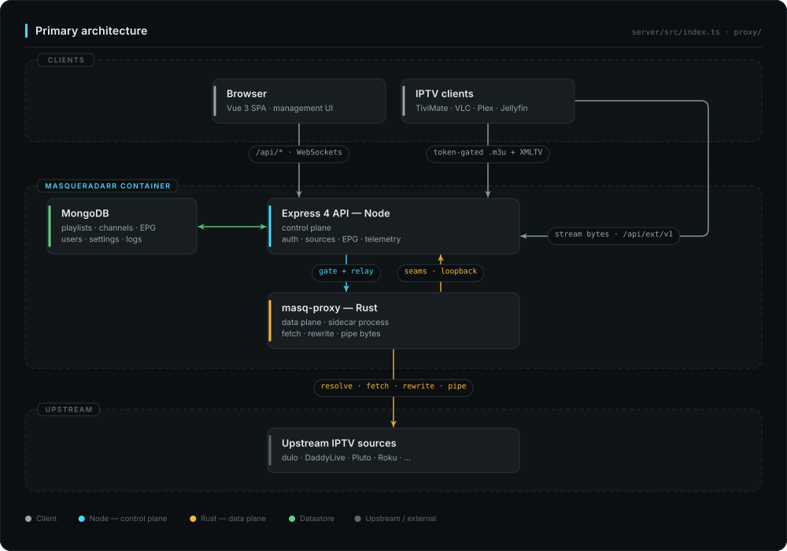

Key subsystems:

- **Sources adapter framework** — a source-agnostic core (sync → normalize → dedupe → resolve) with
  17 built-in provider adapters, plus proxy-only sources — **direct** (passes user-imported stream URLs
  straight through), **hdhomerun** (imports a local tuner's channel lineup; playback is dormant
  pending remux support in the video engine) and **local** (Local Now's per-market playlists) — that back
  bring-your-own playlists.
- **Channel model** — a pristine synced reference (`sourcechannels`) projected into an editable,
  UI-facing store (`playlistchannels`); user edits survive re-syncs.
- **EPG + scheduler** — multiple guide ingesters behind one shared sync path — **Gracenote**,
  **EPG-PW**, **Jesmann**, and user-supplied **Custom XMLTV** (file upload or re-fetchable remote URL,
  streamed so multi-GB national guides parse with bounded memory) — plus the self-built guides that
  **built-in** carry. All driven by a `croner`-backed runtime scheduler over a persisted
  `cronjobs` collection.
- **Composition + export** — composes Global, per-user, and custom `.m3u` playlists with matching
  XMLTV guide siblings for downstream clients.
- **Video proxy engine — live.** A **remux-free Rust data-plane sidecar** (`masq-proxy`) resolves each
  stream on demand and serves it over a durable HLS / raw-TS pipe (retry, mirror failover, read-ahead
  buffering). Node stays the control plane (auth, resolve, token gate, telemetry authority); Rust moves
  the bytes. See [Video Proxy Engine](#video-proxy-engine).
- **Backup & maintenance** — full-system gzip backup / restore, scheduled backups, and Mongo
  index-rebuild / workspace-reset maintenance actions.

### Migration status

The rename and re-architecture are effectively complete: the codebase, brand, runtime, and Docker
images are all **masqueradarr**. The compose stack pulls the standard app image
**`iflip721/masqueradarr`** (built from `docker/app.Dockerfile`); the all-in-one variant is built from
`docker/aio.Dockerfile`. If you're coming from TVApp2: there is **no in-place upgrade path** —
masqueradarr is a new application with a new data model (MongoDB instead of flat files), so stand it up
fresh and re-add your sources through the UI.

### Lineage & credits

masqueradarr is the successor to **[TVApp2](https://github.com/TheBinaryNinja/tvapp2)** by
[TheBinaryNinja](https://github.com/TheBinaryNinja), and inherits its core aggregation framework
(ported from the sibling project). TVApp2 remains available, archived, and deprecated —
all new development happens here.

# Features

**Aggregation & delivery**

- Pulls **M3U playlists** and **EPG / XMLTV** guide data from multiple IPTV providers and normalizes
  them into one catalog.
- **Resolve-on-demand catalog** — each stream is resolved at play time (no dead URLs on disk), which is
  what makes **authenticated**, **token-gated**, and **rotating-mirror** sources possible. The bytes are
  served by the **Rust video proxy engine** (see [Video Proxy Engine](#video-proxy-engine) below).
- **Delivery surfaces** — an in-app slide-out player and M3U / XMLTV export for external clients
  (TiviMate / VLC / Emby / Jellyfin / Plex).
- **Composition + export** — builds Global, per-user, and custom `.m3u` playlists, each with a matching
  XMLTV guide sibling advertised via `x-tvg-url`.

## Getting started

masqueradarr ships as Docker images. There are two deployment shapes.

### Option A — Compose stack (app + MongoDB)

1. Copy the env template and fill it in:

   ```bash
   cp .env.example .env
   ```

   At minimum set `MONGO_ROOT_USER` / `MONGO_ROOT_PASS`, your `DOMAIN`, and the host volume paths
   (`COMPOSE_PATH`, `BACKUPS_PATH`, `MONGO_DATA_PATH`) — each host dir must be writable by **uid 1000**
   (the container's `node` user). To publish on a host port other than `3000`, set `MASQUERADARR_PORT`
   (and update `DOMAIN` to match).

2. Bring it up:

   ```bash
   docker compose up -d
   ```

3. Open `http://localhost:3000` (or your `DOMAIN`; the host port reflects `MASQUERADARR_PORT`). The app
   **self-provisions** its `config.json` from the `.env` on every boot — there is no host config file to
   manage.

### Option B — All-in-one (single container)

A second image bundles **app + MongoDB + config bootstrap** into one container, so the whole stack runs
from a single `docker run` with no external database — ideal for a quick trial or a small home server. One
`/data` volume persists the database, exports, config, and credentials. It's published under the
**`iflip721/masqueradarr`** name (see **Migration status** above).

> **No-AVX hosts (Synology NAS, Atom/Celeron, older Xeons, kvm64/qemu64 VMs).** On amd64 the bundled
> MongoDB 7.0 requires a CPU with AVX — without it mongod dies at boot with `Illegal instruction (core
> dumped)`. Those hosts want the **`mongo4.4-`** tags, an otherwise-identical image built with MongoDB
> 4.4 (which predates the AVX requirement): `iflip721/masqueradarr-aio:mongo4.4-latest`. It needs a
> **fresh `/data` volume** — a database written by MongoDB 7.0 cannot be opened by 4.4. To carry data
> across, generate a backup from **Settings → Data** on the 7.0 image, boot this one on an empty volume,
> then restore. Alternatively, use the compose stack with `image: mongo:4.4`.

To publish on a different host port, change the left side of the `-p` mapping — e.g. `-p 8080:3000`
(the container always serves on `3000` internally; `MASQUERADARR_PORT` only applies to the compose stack).

## First run

On first launch there are **no users** — the app reports `needsSetup` and the SPA walks you through
creating the **first admin account**. After that:

1. **Add a playlist** — the Add Playlist modal offers every built-in source plus custom playlists
   (clone / file / URL / HDHomeRun).
2. For an **authenticated** source (dulo), capture a login session from **Settings** (a server-streamed
   Chromium signs you in; only tokens are stored). The server then **keeps the session alive on its own**,
   rotating the token ahead of each expiry — and it **auto-discovers dulo's current Supabase config at
   runtime**, so when dulo migrates its Supabase project (rotating the public URL + anon key) the session
   self-heals on its next refresh with no re-capture and no key to bump. If you captured the session
   from your own browser (pair/paste), just **close that dulo tab — don't sign out**: signing out of
   dulo revokes the very session you handed over.

   dulo also **rebrands onto new domains** periodically, and that one *is* operator-configurable: the
   **Domain** field on the same panel (Settings → Advanced → Dulo.tv Authentication) drives every
   dulo-facing hop — catalog fetch, playback-session mint, Supabase bundle scrape, the pairing bookmarklet,
   the streamed login, and the SSRF apex. **Auto-detect** follows a redirect from the old domain (it finds a
   rebrand that left a 301 behind; a hard cut-over has to be typed in), and **Test** probes a candidate
   without saving it. Saving a *changed* domain **signs the dulo session out** — a captured session belongs
   to the site it came from — so re-pair afterwards.
3. **ZLive** has two operator settings of its own (Settings → Advanced → ZLive), and it is worth reading
   the [ZLive notes](#zlive-operator-notes) before adding it:
   - **Domain** (`zliveDomain`, default `zlive.st`) — the one domain its public channel catalog
     (`cast.<domain>`) and its stream resolver (`iptv.<domain>`) live under. Stored channels are host-free
     `zlive://<slug>` entries, so a domain change never breaks a channel or an exported M3U line; sync the
     playlist afterwards to refresh its channel list. **Test** fetches only the candidate's public catalog —
     never the stream resolver — and reports a redirect rather than following it.
   - **Concurrent channels** (`zliveMaxStreams`, default **2**, `0` = no limit) — how many *different*
     ZLive channels may play at once, ZLive backups in failover groups included. Viewers of one channel count
     once; a new channel over the limit is refused with a plain-text `429` the player shows, until one stops —
     unless it heads a failover group with a backup from another provider, which then plays instead.
4. **Sync now** to populate channels, then optionally add **EPG Sources** and link guide data on the
   **Channel Mapping** screen.
5. Create **Users** with per-user access lists — each gets a personal **tokenized `.m3u` + XMLTV guide
   URL** for their IPTV client.

### Configuration

All runtime settings live in **MongoDB** and are editable on the **Settings** screen (domain, DNS
nameservers, video configuration, backups, …). The **DNS nameservers** govern both halves of the engine:
Node's outbound fetches *and* the Rust data plane's upstream lookups ask the configured servers first and
fall back to the OS resolver on any failure (so `.local` / LAN names keep working), and a change reaches the
running sidecar on its next flush to Node, no restart. The `.env` only **bootstraps infrastructure on first
boot**:

| Variable | Purpose |
|---|---|
| `MASQUERADARR_PORT` | Host port mapped to masqueradarr (default `3000`). |
| `MONGO_ROOT_USER` / `MONGO_ROOT_PASS` | MongoDB root credentials; also assemble the app's `mongoUri`. |
| `DOMAIN` | Public base URL written into composed playlist / guide links. |
| `DISPLAY_NAME` | App display name. |
| `TZ` | Container timezone (used by the scheduler). |
| `COMPOSE_PATH` | Host dir for composed `.m3u` + XMLTV exports (uid-1000 writable). |
| `BACKUPS_PATH` | Host dir for scheduled backups. |
| `MONGO_DATA_PATH` | Host dir for persistent MongoDB data. |
| `MONGO_HOST_PORT` | Host port mapped to mongod (default `27017`). |
| `MONGO_URI` / `MONGO_HOST` | Optional — point the app at an external / Atlas MongoDB instead of the compose `mongo` service. |
| `DNS_LOG_LEVEL` | Outbound-DNS trace verbosity (`1`–`3`); seeds the setting on first boot. |
| `MASQ_EDGE` | Optional (default off). `1` inverts the topology so the Rust proxy owns the public port and Node runs behind it on a loopback internal port — same public port, reversible. Enable for scale / high concurrency. See [Public edge mode](#public-edge-mode-masq_edge). |

> App-settings vars are seeded with `$setOnInsert` — they apply on the **first provision only**. Change
> them in the Settings UI afterward; a redeploy won't clobber UI changes.

> [!IMPORTANT]
> This sample enviornment variable is also included in the release notes and the `main` branch repository: `.env.example` \
> Ensure you update `COMPOSE_PATH` `BACKUPS_PATH` `MONGO_DATA_PATH` with the appropriate folders for your system. \
> \
> For the best experience, create each folder path assigned to `COMPOSE_PATH` `BACKUPS_PATH` `MONGO_DATA_PATH` before composing the docker stack. 
> ```bash
> mkdir compose && chown -R 1000:1000 ./compose && chmod -R 777 ./compose
> mkdir backups && chown -R 1000:1000 ./backups && chmod -R 777 ./backups
> mkdir mongo && chown -R 999:999 ./mongo && chmod -R 777 ./mongo
> ```

### Development

The repo is **two independently-built npm packages** (not a workspace):

```bash
# Frontend (repo root) — Vite dev server on :5173, proxies /api → http://localhost:3000
npm install && npm run dev

# Backend (server/) — tsx watch on :3000 (needs a reachable MongoDB)
cd server && npm install && npm run dev
```

There is **no test runner and no linter** — correctness is verified by `npm run build` (type-check) in
each package and by running the app. The Rust `proxy/` crate is the exception: CI builds it, lints it
(`cargo clippy -- -D warnings`) and runs its in-file `cargo test` suites.

# Pluggable sources

- A **source-agnostic adapter framework**: adding a provider is one adapter file plus one registry line;
  the generic core (sync → normalize → dedupe → proxy) never branches per source.

| Source | Mechanism |
| --- | --- |
| Distro TV | `makeFastSource` · jsrdn `tv_v5` catalog (Android-TV UA) · geo-qualified channel IDs · per-play double-underscore VAST macro expansion via `resolveStream` · distro.tv Origin/Referer-gated CDN · separate guide from `epg/query.php` |
| FreeLiveSports | `makeFastSource` · Unreel/PowR sports catalog · direct-HLS masters bearing Unreel VAST macros (`[DEVICE_ID]/[CB]/[REF]/[UA]/…`) · per-play macro expansion via `resolveStream` |
| LG Channels | `makeFastSource` · Public mirror via `schedulelist` (catalog + XMLTV guide in one call) · direct-HLS masters bearing `[DEVICE_ID]/[UA]/[NONCE]/…` VAST macros · per-play macro expansion via `resolveStream` |
| (**Local Now**) | Sentinel-resolve adapter · `localnow://<id>?slug=<slug>` stored at sync · resolves to a fresh signed CDN master per play · market-scoped channel set imported via `local/import.ts` · US-only (geo-gated) |
| Plex | `makeFastSource` · sentinel+resolve · `/lineups/plex/channels` catalog yields channel ids + metadata · fully anonymous `X-Plex-Token` JWT (cached, no credentials) · per-play signed library/parts HLS master that 302s to AWS MediaTailor · self-EPG from a per-channel, per-day grid fanout |
| DaddyLive | HTML catalog scraped from a runtime-selected rotating mirror (`mirrorDirectory.ts`) · `watch.php?id=<N>` entry sentinel · 3-hop, Referer-gated scrape per play to a fresh signed playlist · **six independent embed providers per channel** ("Player 1..6"), walked and learned per channel (`playerMemory.ts`) with a provider-agnostic hop-2 reader (`embedExtractors.ts`) · dynamic SSRF allow-set · self-EPG via schedule scrape + Gracenote crosswalk |
| dulo.tv | **Authenticated** · Supabase session captured by a server-streamed Chromium (or pair / paste) and kept alive by the server, with dulo's Supabase config auto-discovered at runtime · `dulo://channel/<id>` sentinel → a device-bound, expiring playback session minted per play · operator-set domain (Settings → Advanced) · no committed snapshot · Gracenote crosswalk |
| Pluto TV | `makeFastSource` · sentinel+resolve · `/v2/guide/channels` catalog yields channel IDs only · stateful per-region boot session (`boot.pluto.tv`) · per-play JWT-stitched HLS master from the stitcher CDN |
| STIRR | `makeFastSource` · sentinel+resolve · `videos/list` catalog yields video IDs + provider-EPG pointers · per-play resolve via `POST /playable` · bundled provider guide |
| Samsung TV+ | `makeFastSource` · Public mirror (`i.mjh.nz`) · no auth · jmp2.uk short-link redirect followed per play to a rotating CDN master · dynamic SSRF allow-set learned at play time |
| TCL TV+ | `makeFastSource` · sentinel+resolve · `livetab → programlist` catalog via the ideonow.com gateway · per-play HLS master minted by a `format-stream-url` POST |
| Roku Channel | `makeFastSource` · sentinel+resolve · `/api/v2/epg` catalog yields channel IDs and metadata only · stateful Cloudflare-sensitive anonymous session · per-play JWT-signed HLS master from Roku's OSM CDN |
| Tubi TV | `window.__data` scrape of `/live` for channel catalog · per-channel EPG + short-lived JWT-signed HLS manifest from `/oz/epg/programming` · the stored entry is the stable `…/oz/epg/programming?content_id=<id>` URL, re-resolved per play (the manifest is minted per request) · Gracenote crosswalk for the curated US channels, then self-EPG via `afterSync` for the rest |
| Vidaa Free TV | `makeFastSource` · direct-HLS (identity `resolveStream`) · client-config bootstrap (BOURL + tenant) · geo-qualified channel IDs · ad-DI macros stripped at catalog time |
| Vizio WatchFree+ | `makeFastSource` · direct-HLS (identity `resolveStream`) · public anonymous catalog from `watchfreeplus-epg-prod.smartcasttv.com` · ad-DI macro placeholders substituted with privacy-neutral values at normalize time |
| Whale TV+ | `makeFastSource` · macro-expansion · keyless auth bootstrap (apiToken → short-lived bearer) · Ottera/SSAI ad macros (`[did]/[session_id]/[cachebuster]/…`) expanded per play via `resolveStream` |
| Xumo Play | `makeFastSource` · sentinel+resolve · Valencia catalog yields channel IDs only · 3-hop per-play resolve (broadcast → asset → HLS source → macro-fill) |
| ZLive | `makeFastSource` · one GET of the public `cast.<domain>/channels.json` catalog (linear channels only; no logos, guide ids or numbers) · host-free `zlive://<slug>` sentinel → one resolver GET per play whose `302` names a signed, ~2.5 h media playlist, reused per channel until 10 min before it expires · segments are MPEG-TS disguised as RIFF/WEBP images, unwrapped by the data plane · **origin-forced**, probe-exempt, capped at 2 concurrent channels by default · operator-set domain · no committed snapshot · station-id guide crosswalk onto your Gracenote / Jesmann guides. See [ZLive notes](#zlive-operator-notes) |

## Custom playlists (bring your own)

- **Clone** — hand-pick channels from any synced source into a curated playlist; the channels are
  independent copies (so edits don't disturb the originals) but streams still route through the real adapter.
- **Import** — pull in any remote **M3U URL** (re-syncable), upload a static **`.m3u` file**, or expose a
  local **HDHomeRun** tuner (its channel lineup is imported; playback — the TS→HLS remux — is dormant
  pending remux support in the video engine).
- Every custom playlist rides the same per-user, token-gated **`.m3u` + XMLTV** export machinery as the
  built-in sources.

## Local Now playlist

- Local Now ([localnow.com](https://localnow.com)) is a US-based FAST (Free Ad-Supported Streaming TV) service that delivers a **market-specific** lineup of live channels — local broadcast stations, regional news, and national FAST networks — curated by geographic television market. Masqueradarr integrates it as a fully managed, re-syncable custom playlist type with a bundled EPG guide.

> [!NOTE] 
> **US-only.** Local Now is geo-gated to US IP addresses. Attempting to add a Local Now playlist from a non-US IP will return a clear error. No VPN workaround is built in; route the server through a US network to use this feature.

### _Local Now_ : City / Market Lookup

When adding a Local Now playlist you choose a **city/market** — the geographic unit Local Now uses to select a channel lineup. Masqueradarr exposes two ways to pick one:

| Method | How it works |
|--------|-------------|
| **City search** | Type at least 2 characters in the city field. A typeahead calls `GET /api/import/local/cities?q=` which queries Local Now's `City/Search` API and returns matching cities with their market identity. |
| **Auto-detect** | Click "Use my detected market." The server reads the geo-detected market from Local Now's own homepage response and pre-fills the closest market to the server's public IP. Falls back to New York City if the homepage carries no geo signal. |

### _Local Now_ : DMA and Market — what they are

Every choice resolves to two stored identifiers:

| Field | What it is | Example |
|-------|-----------|---------|
| **DMA** (`marketDma`) | A numeric [Designated Market Area](https://en.wikipedia.org/wiki/Media_market) code — the Nielsen/TV-industry identifier for a regional television market. | `501` (New York) |
| **Market** (`marketSlug`) | A comma-joined list of Local Now market slugs — a primary city slug plus any associated PBS station slugs for that market. | `nyNewYorkCity,pbs-wnet,pbs-wedh,pbs-wliw,pbs-wnjt` |

Both are stored on the playlist row and are used together as the query parameters for every upstream catalog/guide fetch. They are set once at creation and never modified afterward (to change market, delete the playlist and create a new one).

### _Local Now_ : What the Playlist Provides

When you add a Local Now playlist, Masqueradarr:

1. **Creates a custom playlist row** (`source: 'local'`, `endpoint: 'custom'`) with the market's DMA and slug stored directly on the playlist.
2. **Immediately syncs the market's channel lineup** from Local Now's combined catalog + guide endpoint. Channels appear in the playlist the moment creation completes.
3. **Prunes subscription-locked channels** — any channel with `subscription_access.unlocked === false` is excluded; only freely available content is imported.
4. **Deduplicates** the raw channel list by channel ID before writing.

### _Local Now_ : Channel fields

Each imported channel carries:

| Field | Value |
|-------|-------|
| Name | The channel's display name from Local Now |
| Group | `Local News` for local broadcast stations (identified by W/K call signs, `My City` genre, `hyperlocal`/`epg-local-now` slugs), otherwise the first IAB genre tag, otherwise `Local` |
| Channel number | The broadcast channel number when provided by Local Now |
| Logo | The channel's logo URL from Local Now |
| Stream entry | An opaque `localnow://<id>?slug=<slug>` sentinel — streams are **resolved on demand** per play via Local Now's DSP backend, not stored as static URLs |

### _Local Now_ : What the EPG Source Provides

Each Local Now playlist automatically creates and owns a **playlist-bound EPG source** (visible in the EPG Sources screen, labeled `<Market> — Local Now`). Key properties:

| Property | Value |
|----------|-------|
| Source | `local` |
| Binding | Playlist-bound (`playlistBinding: true`) — manual sync and schedule controls are hidden in the EPG Sources UI; the **playlist's hourly cronjob** drives all refreshes |
| Guide data | Inline `program[]` from the market's catalog fetch — no separate EPG call needed |
| Guide window | ~5 programs per channel per sync (continuous coverage maintained by the hourly schedule) |
| Program fields | Title, start/end times, description, content rating, season/episode numbers (parsed from Local Now's composite title format), IAB category |
| Channel linking | Channels are **self-linked** automatically at sync time — no manual Channel Mapping required. Each channel's `tvg_id` and `epg` fields are set to point at this EPG source on first sync, so the guide renders immediately |

The EPG source ID matches the playlist ID — they are a matched pair scoped to the same market. Deleting the playlist cascade-deletes the EPG source, all guide channels, all programs, and the hourly cronjob together.

### _Local Now_ : Adding Multiple Local Now Playlists (Different Markets)

You can add as many Local Now playlists as you want, **one per city/market**. Each is fully independent:

| Aspect | Behavior |
|--------|----------|
| **Playlist row** | A separate `playlists` document per market, with its own `id`, `marketDma`, `marketSlug`, and `marketLabel` |
| **Channel storage** | Each market's channels are stored under their own playlist ID — there is no sharing or collision between markets |
| **EPG source** | Each market gets its own `EpgSource` (id = playlist id), its own `epgchannels`, and its own `programs` collection scope |
| **Schedule** | Each market gets its own independent hourly `Cronjob` |
| **Naming** | Masqueradarr disambiguates playlist IDs automatically — if you add "New York" twice the second gets a numeric suffix (`newYork2`) |
| **Deletion** | Deleting one market's playlist removes only that market's channels, EPG, and schedule — the others are unaffected |

**Example:** adding New York (DMA 501) and Los Angeles (DMA 803) gives you two separate playlists (`newYork` and `losAngeles`), two separate EPG sources, and two independent hourly schedules. Each can be assigned to different users via the standard playlist access controls.

## Guide data (EPG)

- Ingests guide data from **Gracenote**, **EPG-PW**, **Jesmann** (guided picker), and any **Custom XMLTV**
  source — an uploaded file or a re-fetchable remote URL, streamed so multi-GB national guides parse with
  bounded memory — plus the self-built guides that **playlist-bound** carry.
- **Channel Mapping** links channels to guide data with composite match-scoring and many-to-one EPG
  linking; the link survives re-syncs.

**Management SPA** (Vue 3)

- Full screens for **Dashboard, Active Streams, History / Metrics, Playlists, EPG Sources, Channel
  Mapping, Users,** and **Settings**.
- An editable channel store where **user edits survive re-syncs**, and shared progress modals for the
  long-running sync / compose operations.

**Users & access control**

- **scrypt** authentication, **admin / user** roles, and **per-user access lists** (allowed playlists /
  custom playlists).
- A session-token vs. stream-token split, and per-user **tokenized M3U access** (token-free download,
  token-gated stream).

**Observability**

- WebSocket-pushed **viewer / bandwidth / buffering telemetry** — the Rust proxy measures the true byte
  edge and reports it over the telemetry seam, so **Active Streams** and **History / Metrics** show real,
  live sessions.
- Live **system-performance** push (CPU / memory) on the Dashboard.
- Persisted **view-session history** + per-user metrics, and **MongoDB-backed application logs** (13
  categories, 14-day TTL) with a live log drawer — including a dedicated **`proxy`** category fed by the
  Rust engine's full resolve→fetch→rewrite→serve lineage.

> **The video engine is a Rust proxy.** masqueradarr serves video through a **remux-free Rust data-plane
> sidecar** (replacing an older transcode engine) that resolves each stream on demand and rewrites its
> `.m3u8` manifests — see [Video Proxy Engine](#video-proxy-engine) for the full picture. The one part
> still pending is remux / transcode (e.g. HDHomeRun TS→HLS).

**Scheduling**

- A `croner`-backed runtime scheduler over a persisted `cronjobs` collection: playlist re-sync, EPG
  re-sync, M3U / XMLTV recompose, and scheduled backups.

**Backup & restore**

- One-click **full-system backup** — a gzipped snapshot of every collection, downloaded or written to a
  configured backup directory on a schedule.
- **Restore** from an uploaded backup or a saved file; the restore re-orchestrates the dependent
  subsystems (boot init, DNS, scheduler) in place.
- **Maintenance** actions from Settings: rebuild MongoDB indexes, or reset the workspace (wipe content,
  keep users / settings).

# Channel Adapter Architecture : _Pluggable sources_

All adapters implement the `SourceAdapter` contract (`server/src/sources/types.ts`) and are registered in `server/src/sources/registry.ts`. The generic core (`buildSource`) never branches per source — every per-source difference is encapsulated in the adapter object. Each adapter's `resolveStream`/`proxy` are **live** — the Rust data-plane engine calls them per stream through the resolve seam (see [Video Proxy Engine](#video-proxy-engine)).

When a source needs different behaviour from the core, it **declares a capability** rather than being special-cased by id — neither the Node core nor the Rust engine ever tests `source === '…'`:

| Capability | Declared on | What the core does with it |
|---|---|---|
| `playerSelectable` | adapter | alternate-upstream stage before failover children; player picker in the UI |
| `probeExempt` | adapter | the scheduled probe sweep skips the source's channels (per channel, on `origin ?? source`) |
| `maxConcurrentStreams()` | adapter | the resolve seam counts each live stream against the adapter serving it (failover backups included) and refuses a NEW one over the cap — a definitive `429 source_stream_cap`, or a walkable `502` when a failover backup elsewhere could carry it |
| `applyEpgLinks()` | adapter | re-run after every successful Gracenote / Jesmann guide sync — and after such a guide is added — for built-ins that crosswalk onto guides they don't own |
| `adSignature` | `proxy` bag | rides the grant; the local origin's ad classifier for sources with no cue tags |
| `originRequired` | `proxy` bag | forced into the grant's `proxyConfig.originEnabled`, whatever the proxy config says |
| `segmentUnwrap` | `proxy` bag | rides the grant; the pass-through byte paths strip a disguised segment's container prefix |

The `/api/sources` manifest publishes the flags the SPA needs (`playerSelectable`, `probeExempt`, `originRequired`), so the UI never hardcodes a source list either.

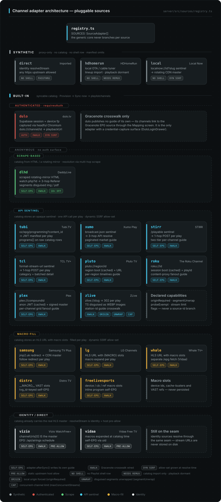

## Key Properties Summary

| Adapter | Label | Auth | Resolve Strategy | Self-EPG | Gracenote XWalk |
|---------|-------|------|-----------------|----------|-----------------|
| `direct` | Imported | — | Identity (passthrough) | — | — |
| `hdhomerun` | HDHomeRun | — | Catalog import (playback dormant — needs remux) | — | — |
| `local` | Local Now | — | Sentinel → rotating CDN | — | — |
| `dulo` | dulo.tv (default; operator-set) | session | `dulo://` sentinel → playbackUrl | — | yes |
| `dlhd` | DaddyLive | — | `watch.php` → 3-hop scrape, 6 providers | yes | yes |
| `tubi` | Tubi.TV | — | `…/oz/epg/programming?content_id=` → Tubi API (JWT manifest) | yes (inline) | yes |
| `xumo` | Xumo Play | — | broadcast.json → 3-hop API | yes | yes (wired) |
| `stirr` | STIRR | — | `/playable` → 1-hop POST | yes | yes (wired) |
| `tcl` | TCL TV+ | — | `format-stream-url` → 1-hop POST | yes | yes (wired) |
| `pluto` | Pluto TV | — | `pluto://` → region boot + URL | yes | yes (wired) |
| `roku` | The Roku Channel | — | `roku://` → session + playId | yes | yes (wired) |
| `plex` | Plex | — | `plex://` → anon JWT + signed master | yes | yes (wired) |
| `zlive` | ZLive | — | `zlive://` → resolver `302` → signed playlist · origin-forced | — | station ids (Gracenote / Jesmann) |
| `samsung` | Samsung TV Plus | — | jmp2.uk redirect | yes | yes (wired) |
| `lg` | LG Channels | — | `{MACRO}` fill per play | yes | yes (wired) |
| `whale` | Whale TV+ | — | macro fill per play | yes | yes (wired) |
| `distro` | Distro TV | — | `__MACRO__` fill per play | yes | yes (wired) |
| `freelivesports` | FreeLiveSports | — | macro fill per play | yes | yes (wired) |
| `vizio` | Vizio WatchFree+ | — | Identity (direct HLS master) | yes (airings) | yes (wired) |
| `vidaa` | Vidaa Free TV | — | Identity (macros pre-expanded) | yes | yes (wired) |

**Gracenote XWalk:** *yes* — a committed `seed-data/<id>-playlist-addon.json` links channels onto your
Gracenote guides after every sync (fill-only-if-untouched); *yes (wired)* — the call is in place but no addon
is committed yet, so it no-ops (committing one is all it takes to turn it on); *station ids* — ZLive's rows pin
a Gracenote station id and link to whichever of your Gracenote or Jesmann guides carries it (see
[ZLive notes](#zlive-operator-notes)); *—* — no crosswalk hook at all.

## Lifecycle: how a built-in source reaches the UI

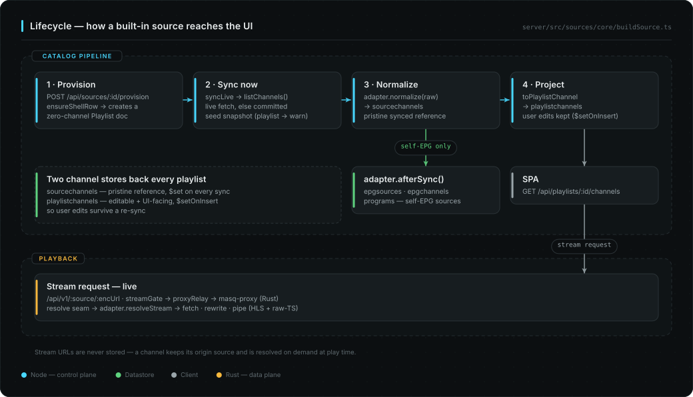

# Playlists

> **Scope:** the playlist data model — what a playlist *is*, the built-in vs. custom kinds, how guide
> data binds to it, and how per-user access is granted. The catalog (`playlistchannels`) and the export
> surface (`.m3u` + XMLTV guide sibling) meet here.

## How Playlists work

A **Playlist** is a row in the `playlists` collection — the *envelope* (name, hosted URL, endpoint mode,
schedule, state). Its **channels live separately** in `playlistchannels`, queried by the playlist's
`source` (or clone) id. A playlist row with no channels is a valid, paused shell.

- **Two channel stores back every playlist.** A sync writes a pristine, source-of-truth `sourcechannels`
  reference, then projects it into the editable, UI-facing `playlistchannels`. You edit the latter (rename,
  disable, channel #, EPG link) and your edits **survive a re-sync**: a sync `$set`s source-derived fields,
  `$setOnInsert`s the user-editable ones, and prunes channels that vanished upstream.
- **Hosted URL + endpoint mode.** A `global`-endpoint playlist is served through the one consolidated Global
  M3U endpoint; a `custom`-endpoint playlist is served at its own path. The `url` ("HOSTED AT") always
  prepends `settings.domain`, so changing the domain in **Settings cascades** to every playlist's URL.
- **State + schedule.** `state:false` pauses the endpoint (downstream clients get a 404). `interval` + `auto`
  drive the scheduler; a manual **Sync now** is always available.
- **Streaming is resolve-on-demand.** A channel's stream URL is *derived* (`/api/v1/<source>/<enc-entry>`),
  never stored — the Rust video proxy resolves the real upstream at play time. Every channel keeps its
  `origin` source, so a cloned or imported channel routes through the right adapter's resolver.

## What kinds of playlists are possible

| Kind | `source` tag | Created via | Channels |
|---|---|---|---|
| **(Default) source playlist** | `<dynamic>` | Add Playlist → **Built-In** (provisions a zero-channel shell; populates on first **Sync now**) | Synced from the adapter; `id === source` |
| **Clone** | `clone` | Add Playlist → **Clone** — hand-pick channels from any synced source | Independent COPIES in `playlistchannels`; `origin` = the provider source for routing |
| **URL import** | `url` | Add Playlist → **URL** — fetch a remote `.m3u` / `.m3u8` | Parsed from the upstream; re-syncable via the stored `remoteUrl` |
| **File upload** | `file` | Add Playlist → **File** — upload a static `.m3u` | Parsed once from the uploaded file |
| **HDHomeRun** | `hdhomerun` | Add Playlist → **HDHomeRun** — point at a LAN tuner (`deviceUrl`) | Discovered from the device (channel lineup); playback (TS→HLS remux) is dormant pending remux support in the video engine |

Built-in defaults are **Global-endpoint** by default; the custom kinds are **Custom-endpoint** and ride the
per-playlist export machinery (their own path + guide sibling). All the type tags (`clone`/`file`/`url`/
`hdhomerun`) and modes (`global`/`custom`) are stored **lowercase**.

## Failover groups (channel backups)

Any playlist's channels can be grouped into a **failover group**: one **parent** plus an ordered list of
**children** — silent backups for the same real-world channel, possibly from **different providers**.
Select the channels on the playlist detail screen → **Group** → pick the parent, drag the children into
priority order, save.

- **One line exported.** The composed M3U (and its guide) contains only the **parent**; children are
  hidden from every export surface but stay visible (badged `parent` / `child`) in the management UI.
- **EPG identity is inherited.** Children mirror the parent's `tvg_id` / `epg` link — set at group save and
  re-cascaded whenever the parent's EPG link changes (drawer, Mapping screen, bulk edits). Direct EPG edits
  on a child are rejected (`409 failover_child_epg_locked`); auto-match skips children.
- **Play-time failover (establish-time).** When the parent's stream fails to establish — resolve failure,
  transport failure after retries, or (opt-in) a definitive upstream error — the data plane walks the
  children **in order** via `attempt=1,2,…` resolves and serves the first one that answers, under the
  parent's URL and stream identity. The session then **sticks** to the winning child (the failover cursor
  never walks back to the dead parent mid-play); the pin resets a few idle minutes after playback stops.
  A `429 source_stream_cap` refusal is **not** a failure and never starts a walk, so the seam sends it only
  when no backup could help: a capped parent whose group has a backup on another provider (with failover
  enabled) is refused with a walkable `502` instead, and the walk reaches that backup. Backups count against
  their **own** provider's limit — a ZLive backup under a DaddyLive parent takes a ZLive slot, and is skipped
  (walkable `502`, next candidate) when ZLive is full; a ZLive parent carried by its DaddyLive backup takes none.
- **Cross-provider safe.** A child's grant carries its own adapter's headers, capabilities and proxy config
  under its own policy key (`policySource`), so a dlhd parent backed by a pluto child never pollutes dlhd's
  other streams — and a ZLive child walked to from a plain pass-through parent is still unwrapped if it ends
  up served on that pass-through path.
- **Observability.** Active Streams badges a failed-over stream with `failover → <child>`; the scheduled
  channel probe keeps probing hidden children (except those from a `probeExempt` source such as ZLive), so a
  dead backup is visible before failover ever reaches it.
- **Self-healing.** Any prune/delete that removes a group's parent (or its last child) auto-disbands the
  group; disbanding is also available in the Group modal — children keep their inherited EPG link but
  re-enter the export. Children must stay **Active** to remain probe-covered and candidate-eligible
  (a `Disabled` child is skipped at failover; a `Disabled` parent hides the whole group from exports).

Knobs: `failoverEnabled` (default **on** — configuring a group is the real opt-in) and
`failoverOnDefiniteError` (default **off**) in the [proxyconfigs subsystem](#tuning-knobs--the-proxyconfigs-subsystem).
Seamless mid-segment splicing is a future enhancement — a parent dying mid-play is caught on the player's
next playlist refetch.

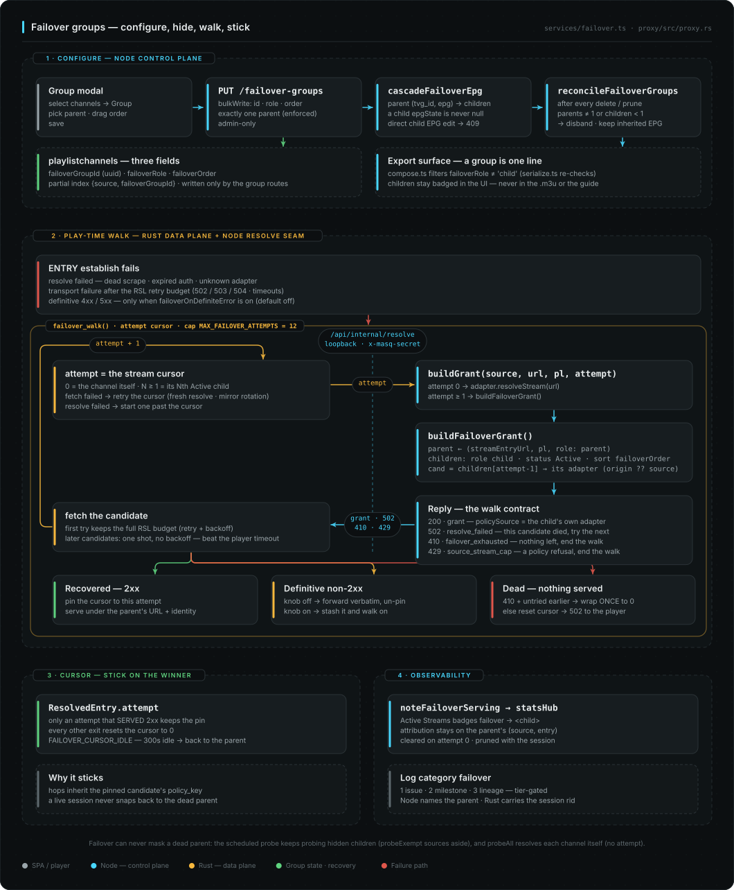

## DaddyLive players (alternate upstreams)

DaddyLive's channel pages offer **PLAYER 1..6**. These are **not** redundant embeds of one feed — each
button loads a **different third-party provider**, and they do **not** all carry the same channels. Ch 648
(Boomerang USA), verified live: Player 1's own CDN `404`s it, Players 2/3/5/6 are Cloudflare-gated, dead or
NXDOMAIN, and only Player 4 — an entirely separate operator — actually carries it.

So picking a player picks a **provider**, and which provider works varies per channel and drifts over time.
The resolver is built around that:

- **Provider-agnostic hop 2.** Any `<iframe>` on the player page is a candidate (the `/premiumtv/` embed is
  simply tried first), and the signed playlist URL is read by an ordered chain of extractors —
  base64/`atob`, plaintext, an XOR-array `eval` blob, a p·a·c·k·e·d payload, hex escapes
  (`sources/adapters/dlhd/embedExtractors.ts`). Each recovers whatever constants the page carries rather
  than hardcoding them, so a key rotation self-heals; a genuinely new obfuscation is a ~10-line addition.
- **Both playlist shapes are valid.** Providers return either a master (`#EXT-X-STREAM-INF`) or a media
  playlist (`#EXTINF`) — an `#EXTM3U` with neither is now rejected instead of being served as an empty stream.
- **Learned + sticky.** The winning player is remembered per channel (~30 min) and a failing one is burnt
  (~5 min), so the common case stays a **single** hop-1 fetch even when the winner isn't Player 1
  (`playerMemory.ts`). The operator's pick — Settings → *DaddyLive Player Source*, or the per-channel
  override in the channel drawer — always leads; the rest are the fallback order.
- **Bounded.** Every hop has a timeout (`DLHD_HOP_TIMEOUT_MS`, 8 s) and the whole walk has a deadline
  (`DLHD_RESOLVE_BUDGET_MS`, 20 s) so a hanging provider can't outlast a player's manifest timeout.
- **Play-time rotation.** The data plane's first failover attempt re-resolves the same channel through a
  *different provider* (the seam burns the one that was serving); only then does it start walking the
  channel's configured [failover-group children](#failover-groups-channel-backups). Active Streams badges
  the result — `failover → Player 4`.

Knobs: `DLHD_PLAYER_STICKY_MS`, `DLHD_PLAYER_BURN_MS`, `DLHD_HOP_TIMEOUT_MS`, `DLHD_RESOLVE_BUDGET_MS`,
plus the existing `DLHD_PLAYER` (source-wide default, also settable in the UI) and `DLHD_BASE`.

> These providers are third parties that rotate — this layer is the most churn-prone part of the adapter by
> design. When DaddyLive itself stops carrying a channel on **every** player, failover groups are the
> durable answer.

## ZLive operator notes

ZLive is a free sports / linear restream site. Its catalog is ~177 linear channels with no logos, guide ids
or channel numbers, grouped by zlive's own sport buckets (Sports, Kids, F1, Other). Only the 24/7 channels
are imported — its one-off event streams are not.

> [!IMPORTANT]
> **zlive polices restreamers.** It keeps a hand-maintained IP / CIDR **leech list** and answers any address
> on it with a **decoy** (an ad stream) instead of the channel asked for, and its own stats rank clients by
> request volume and by *unique streams per IP*. If your server's address is listed, every ZLive channel
> becomes the decoy — and so does ordinary browsing of zlive from that address (or, for a CIDR entry, from
> its neighbours). masqueradarr **detects and reports** a suspected decoy. It **does not work around** a
> listing — no alternate hosts, no header changes, no retries — and delisting is up to zlive.

How ZLive is served. Each of these is a capability the adapter declares, not a ZLive branch in the core:

- **Always through the [local origin](#local-origin--republishing-the-stream)** (`originRequired`). One
  ingest per channel however many people watch, so zlive sees one client per channel rather than one per
  viewer. Forced whatever the Default / Custom proxy config says; the proxy config panels show it as
  *forced by ZLive*. (The exception: a ZLive channel reached as the failover backup of a non-ZLive parent
  can ride that parent's pass-through stream — still unwrapped.)
- **One resolver request per channel, not per poll.** A play is one `GET iptv.<domain>/<slug>`, whose `302`
  names a signed media playlist valid for ~2.5 h. The adapter reuses that target until 10 min before it
  expires (a quarter of its lifetime, for a token shorter than 40 min), shares one request between concurrent
  joins, and passes the token's expiry to the data plane, which renews ahead of it instead of meeting a `403`
  mid-stream. The lifetime is read on zlive's own clock (the signed expiry minus the `302`'s `Date`), so a
  wrong clock on your server changes nothing. That comes to about one resolver request per channel per 2⅓ h of
  viewing; a warn line says so if zlive ever starts signing much shorter-lived links.
- **A rejected link is replaced, but not on every retry.** If the data plane reports that a link failed
  before its expiry — the CDN refused it outright, or the ingest could not refresh its playlist — the adapter
  drops the reused link and mints a new one — but only once the current link is at least 60 s old, and that
  wait doubles (up to 15 min) while each replacement fails too, so a CDN that refuses every link from your
  address costs a handful of resolver requests an hour rather than one per player retry.
- **Never probed in bulk** (`probeExempt`). The scheduled channel probe skips ZLive channels, so their status
  updates only while one is being watched; the Settings probe card names the exemption.
- **A concurrent-channel limit** (`maxConcurrentStreams` ← Settings → Advanced → ZLive, default **2**). A new
  channel over it gets a definitive `429 source_stream_cap`, relayed to the player as plain text — no failover
  walk, no retry — unless it heads a failover group with a backup from another provider, which then plays
  instead. A ZLive channel serving as a *backup* counts too, and is skipped for the next backup when the limit
  is reached. A second viewer, a reconnect, or the ingest renewing its own token is never refused, and a
  slot frees about 30 s after a channel's last viewer leaves. Raising it is your call; it is the number
  zlive's stats rank clients by.
- **Plain requests.** Catalog, resolver and media requests carry a browser User-Agent and nothing else — no
  Origin / Referer posing as zlive's own player (proxy-config header overrides, if you add any, reach only the
  media hops). A sync is one catalog GET; there is no committed snapshot, and a failed sync leaves the
  playlist on *warn* with every channel it already had. So does a catalog under half the size of the last
  one — the shape of zlive's own upstream re-sync coming back partial, which would otherwise prune your edited
  channels; if zlive really did shrink, the playlist's **Restore Defaults** accepts the smaller list.
- **Disguised segments are unwrapped.** zlive's segments are MPEG-TS hidden inside RIFF/WEBP images on a
  TikTok CDN. The data plane strips the wrapper and relabels them `video/mp2t`, so ffmpeg-based clients
  (Plex, Jellyfin, Channels, mpv) and `outputFormat: 'ts'` get a clean transport stream — see
  [Signed URLs, disguised segments and keyframe joins](#signed-urls-disguised-segments-and-keyframe-joins).
- **One duplicate starts disabled.** The manual `skysportsf1-uk` row resolves to the same feed as
  `sky-sports-f1`; both Active would spend two of the capped streams on one picture. Enabling it sticks.

**When zlive refuses or decoys.** The adapter vets every `302` before the data plane sees it: https only,
zlive's signed-URL shape (or the same registrable domain as the last good answer), and a host that resolves
only to public addresses — IPv6 forms that embed an IPv4 address (NAT64, 6to4, Teredo, IPv4-mapped) included.
That address check is an early refusal, not a guarantee: the data plane resolves the host again when it
connects and itself checks only IP literals, so a DNS answer that changes between the two lookups, or a
private host named inside the signed playlist, is not caught by it. When the resolver answers the **same**
playlist file for **3 or more** channels that are not known aliases of each other — the decoy's signature —
that file is **latched for 30 minutes**: its channels fail with `zlive_decoy_suspected` without contacting
zlive, and a warn line names them.

Failures are not retried at zlive's expense either. A **refusal** (`401` / `403` / `429` from the resolver) is
about your address, not one channel, so it starts a **cool-down** during which no ZLive channel contacts the
resolver: the resolver's own `Retry-After` when it sends one (honoured up to an hour), otherwise 60 s, doubling
with each refusal in a row up to 15 min, and reset by the next good answer. Links already minted keep playing
through it. Any other failed resolve — the resolver down (`5xx`), unreachable or timing out, a DNS failure, an
answer that fails vetting — is not retried for that channel for 30 s. Refusals, unreachable/unavailable and
unexpected answers are reported as separate classes. A failed resolve is an ordinary resolve failure, so a
channel's [failover group](#failover-groups-channel-backups) backups take over if it has any. All of it shows
live on **Settings → Advanced → ZLive** (limit usage, upstream host, last error, any latch or cool-down, and
how many retries were held back) and in the logs — the `playlists` category for the resolver (tag `zlive`),
`proxy` for limit refusals.

**Guide data.** zlive publishes no guide. A committed station-id crosswalk
(`seed-data/zlive-playlist-addon.json`) links its channels onto guides **you already have** — it never fetches
one itself:

1. Add the guides it targets. **Add EPG Source → Gracenote** with a New York City ZIP (e.g. `10001`), picking
   the **DIRECTV** national lineup (`DITV` — most US cable networks) and the **Local Over the Air Broadcast**
   lineup (`OTA` — ABC, CBS, FOX, CW and Telemundo map to the New York stations, so an OTA lineup for another
   market links none of them rather than the wrong ones). For the foreign channels, add **Jesmann** country
   guides in their **7-day Standard** download — the IPTV variants key channels by name, not station id, and
   never match.
2. That's it: adding or syncing any Gracenote / Jesmann guide — manually or on a schedule — re-links ZLive on
   its own, and so does a ZLive playlist sync.

Linking is fill-only-if-untouched, so a link you made or cleared on the Channel Mapping screen is never
overwritten. Deleting a guide counts as clearing: the channels that were linked to it are left *unmatched*,
and the crosswalk will not re-link them to another guide that carries the same station. After replacing one
guide with another (say a Jesmann US guide with DITV), re-link those channels on Channel Mapping or use the
playlist's **Restore Defaults**.

As committed, the crosswalk links 134 channels at high confidence: 76 US channels pinned to DITV or NYC OTA,
and 58 matched by name inside a country-scoped Jesmann guide (UK, Ireland, France, Germany, Italy, Spain,
Poland, Australia, Canada, US). Seven medium-confidence rows are kept for review and never applied —
Brazil's only row, Premiere, is one of them. The remaining 36 are unmatched: 29 have no known station-id
guide (New Zealand ×10, Portugal ×6, India ×5, the Baltics ×3, four streaming-only feeds, and Puerto Rico's
WAPA Deportes), and 7 are in markets that have a guide but were not found in it (Poland: CANAL+ Extra 1/2,
CANAL+ Sport 6, Eleven Sports 4; Spain: Movistar Deportes 2/3, Movistar Plus).

**DNS.** The data plane's upstream fetches — ZLive's playlist and segment hops included — now resolve through
the Settings **DNS nameservers**, as Node's resolve already did, with the OS resolver as the fallback.

## Playlists + EPG Sources with Playlist Binding

Guide data reaches a playlist through **two distinct mechanisms** — keep them separate:

1. **Channel-level guide linking (the everyday case).** EPG attaches to a playlist through its *channels*,
   not the playlist row. Each channel carries a 2-factor **`(tvg_id, epg)`** link — set on the **Channel
   Mapping** screen, self-linked by sources that ship their own EPG, or crosswalked by a built-in's committed
   map onto guides you already have (dlhd / dulo / tubi by `(epg, tvg_id)` pair, ZLive by Gracenote station
   id). At compose time the guide is built
   from exactly the channels that carry a link, so "which EPG sources feed this playlist" is simply
   *whichever sources its channels are mapped to* — many sources can contribute to one playlist's guide.
2. **Playlist-bound EPG sources (`playlistBinding`). **Built-in** carry their *own* inline guide.
   When you sync such a playlist, its `afterSync` hook writes the guide **and** upserts a matching EPG source
   row flagged **`playlistBinding: true`**, then self-links the playlist's channels to it. These rows are
   *owned by the playlist's sync* — the playlist drives their refresh cadence, so the EPG Sources screen
   hides their manual-sync + schedule controls. You never add or schedule them by hand.

## Assigning Playlist access to users

- Access is a **per-user allow-list**, split to mirror the endpoint modes: `allowedPlaylists`
  (Global-endpoint playlists) and `allowedCustomPlaylists` (Custom-endpoint playlists).
- You assign membership on the **Playlists screen** (per playlist — it was moved here off the Users screen),
  not by editing the user.
- **Admins ⇒ every playlist.** An admin account's allow-lists are *materialized* to hold every playlist id
  (a real invariant, not just a role bypass), and creating a new playlist auto-grants it to all admins — so
  an admin always sees the full catalog.
- Each user gets a personal, **tokenized** `.m3u` + XMLTV guide URL for their IPTV client: the **download is
  token-free**, but the **stream is token-gated** to that user's allowed playlists.

---

# EPG Sources

> **Scope:** the guide-data subsystem — what an EPG source *is*, the provider kinds, the one shared sync
> path, how playlist-bound self-EPG differs, and how guide data is woven into a playlist's `.m3u` at
> compose time. The XMLTV wire format itself is the sibling of the M3U export.

## How EPG Sources work

An **EPG source** is a row in `epgsources` registering one guide provider. A sync writes two collections:
**`epgchannels`** (one row per guide channel) and **`programs`** (the airings), both keyed by a composite
**`<epg>:<tvg_id>`** id so multiple sources never collide.

- **One shared sync path.** Every kind goes through `syncEpgSource.ts`, whether triggered by a manual
  **Sync now** or by a scheduler tick; it maintains the per-source `syncSuccessCount` / `syncFailCount` and
  `status`.
- **A sync is a per-source replace.** The source's old channels/programs are swapped for the fresh pull. The
  streaming-XMLTV path replaces up-front, so a mid-stream failure marks the source `error` and the next good
  sync heals it cleanly (the shared `epgchannels`/`programs` collections are scoped by `source`).
- **Reorder + run-stats.** The EPG Sources screen is drag-to-reorder (`order`); the guide-generation
  run-stats (`lastXmlAt`, `xmlGeneratedCount`, `xmlFailCount`) are credited during compose (below).

## What kinds of EPG Sources are possible

The `source` discriminator (stored lowercase):

| Kind | Added via | Notes |
|---|---|---|
| **gracenote** | Add EPG Source → **Gracenote** | Provider/lineup grid; provenance fields (headend / lineup / postal / country / …) let the grid URL be rebuilt + re-synced |
| **epg-pw** | Add EPG Source → **EPG-PW** | epg.pw per-channel XML |
| **jesmann** | Add EPG Source → **Jesmann** (guided picker) | Large national XMLTV guides, **streamed** so multi-GB files parse with bounded memory |
| **xml file** | Add EPG Source → **Custom** (upload) | One-shot uploaded XMLTV document |
| **remote url** | Add EPG Source → **Custom** (URL) | Re-fetchable remote XMLTV URL (streamed, gzip-aware) |
| **playlist-bound** | *(automatic)* — the playlist's `afterSync` binding | **Playlist-bound** self-EPG (`playlistBinding:true`); not user-added |

## EPG Sources with a Playlist Binding + the syncing process

- **Standalone sources** (gracenote / epg-pw / jesmann / custom XMLTV) sync on demand or on a `cronjobs`
  schedule, independent of any playlist.
- **Playlist-bound sources** (built-in) have **no manual sync of their own.** They are written by the
  *playlist's* `afterSync` hook off the same listing that playlist sync already fetched, and the bound source
  row is re-asserted (`playlistBinding:true`) on every playlist sync. To refresh a bound guide you **sync its
  playlist** — the EPG Sources screen deliberately hides their sync/schedule controls because the playlist
  owns the cadence.
- Either way, the *binding between guide data and a playlist's channels* is the channel-level
  **`(tvg_id, epg)`** link — Channel Mapping for user-added sources, self-linked for channel-adapter built-in sources.
- **Built-ins that link onto *your* guides are re-linked after every guide sync.** A built-in whose committed
  crosswalk targets guides it does not own (`applyEpgLinks` — ZLive) would otherwise wait for its own next
  playlist sync to pick up a guide you just added. So every successful **gracenote** or **jesmann** sync —
  manual, scheduled, or the first one that runs when you add the guide — re-runs the crosswalk for each such
  built-in you have added, fill-only-if-untouched and never failing the guide sync.

## How EPG Sources are ingested into playlists during a compose

Guide data only reaches a downstream client at **compose** time, and composition is **playlist-scoped**: a
guide is written as a **sibling of the M3U** by `composeGuide()`, which runs off the *same Active channel set*
`composeM3u()` just wrote (the Global union, or one Custom playlist) — so a guide can never drift from its M3U.

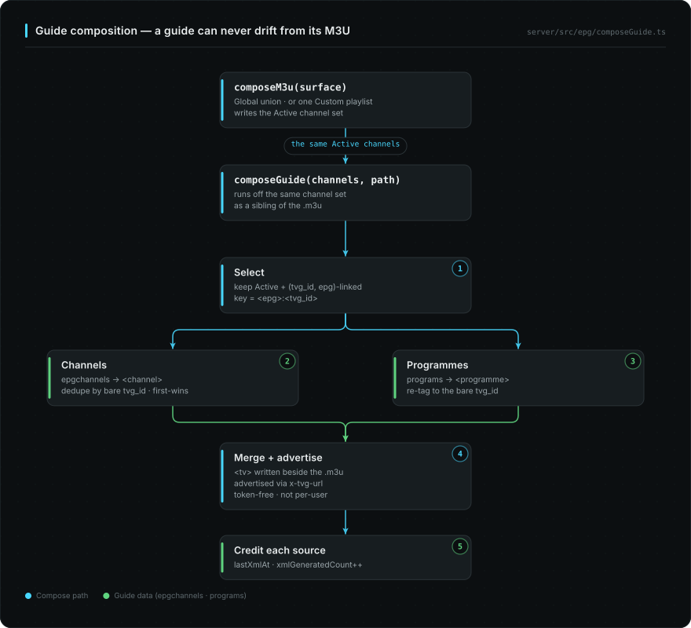

Per composed surface:

1. **Select** — keep only **Active** channels that carry a 2-factor **`(tvg_id, epg)`** link; index them by
   the composite key `<epg>:<tvg_id>`.
2. **Channels** — resolve each key's `epgchannels` row (display-name / call-sign / channel-no) and emit one
   `<channel>`, **de-duped by the bare `tvg_id`** (first-wins — two sources can publish the same id and a
   player can't disambiguate anyway). A channel linked to an `epgchannels` row that isn't synced yet is
   skipped, never orphaned.
3. **Programmes** — pull the `programs` for those keys and emit `<programme>`s, **re-tagged to the bare
   `tvg_id`** so each airing matches its `<channel id>`.
4. **Merge + advertise** — the result merges programme data from **every EPG source the playlist's channels
   link to** into one `<tv>` document written next to the `.m3u`, advertised via **`x-tvg-url`**. The guide is
   **token-free** and **not per-user** (a superset of any one user's channels is harmless).
5. **Credit** — every contributing source gets `lastXmlAt` + `xmlGeneratedCount++` (or `xmlFailCount++` on
   failure).

# Video Proxy Engine

> **Scope:** how masqueradarr actually serves video — a **remux-free Rust data-plane sidecar** (replacing an
> older transcode engine) that resolves each stream on demand and pipes it durably to the player. This
> section covers the two-plane split, the internal seams, the request path, the durability features,
> [local origin mode](#local-origin--republishing-the-stream), the tunable config, and the opt-in public-edge
> topology.
>
> **Remux-free is still true; "passthrough" no longer is.** Nothing is ever re-encoded — but with
> [local origin](#local-origin--republishing-the-stream) enabled the engine stops forwarding the provider's
> playlist and publishes one it wrote itself, from segments it ingested, decrypted and cached in RAM.

## Two planes: Node control plane · Rust data plane

Video is split across **two processes** that ship in the same container:

- **Node — the control plane (the brains).** Everything stateful and provider-specific stays in TypeScript:
  per-source auth (dulo's Supabase session + device fingerprint), scraping (dlhd's rotating-mirror, 3-hop
  Referer-gated resolve), vetting upstream-supplied URLs (ZLive's resolver redirect), per-source stream
  limits, the stream-token gate, telemetry authority, and config storage.
- **Rust — the data plane (the muscle).** A small standalone binary, **`masq-proxy`** (the `proxy/` crate),
  does the byte work: fetch upstream, follow redirects, rewrite `.m3u8` manifests, enforce the SSRF gate,
  and pipe segments — fast, multi-threaded, near-zero-copy. It is **driven per stream by a "grant"** from
  Node; it never re-derives provider logic or branches on which provider it is serving — what a source needs
  arrives as declared grant fields.

Node spawns and supervises `masq-proxy` as a child process (auto-restart with backoff). A missing or crashed
sidecar is **non-fatal** — the app keeps managing playlists / EPG / channels / users and serving M3U / XMLTV
downloads; only live playback pauses until it's back.

**The data plane's SSRF gate.** On the pass-through path every upstream fetch — the entry included — must be
`http(s)` and must not be a private IP literal unless its grant sets `allowPrivate`, which no grant does today
(imported playlists included); a hop named inside a manifest must also be in the stream's allow-set (see
*resolve* below). The local origin's ingest and the raw-TS producer apply the same private-literal check to
every segment and key they pull. "Private" means RFC 1918, loopback, link-local and unspecified IPv4, IPv6
loopback / ULA / link-local, IPv4-mapped IPv6 spellings of any of those, and the whole `localhost` zone. The
check reads literals only — it never resolves a hostname. Two consequences for imported (`direct`) playlists:

- **Bracketed IPv6 literals are now judged, and a private one is refused.** A URL hands an IPv6 host over as
  `[fd7a:…]`, and earlier builds never matched that form against the IPv6 rules, so `http://[::1]/` or a
  tailnet's `http://[fd7a:115c:a1e0::…]:8089/` passed unchecked. Import a tailnet box that you reach over IPv6
  by its **MagicDNS hostname** instead of its address.
- **The shared `100.64.0.0/10` range stays allowed** for data-plane hops — it is carrier-grade NAT space, not
  RFC 1918, and it holds every Tailscale IPv4 address, so an import of `http://100.x.y.z:8089/…` plays as it
  did before. (ZLive vets its own resolver hosts in Node, and refuses that range there.)

## The internal seams (loopback, shared-secret)

Node and Rust talk over one private loopback channel — `POST /api/internal/*`, guarded by a shared
`x-masq-secret` (the SPA never calls it; only the Rust engine does). One contract, four jobs:

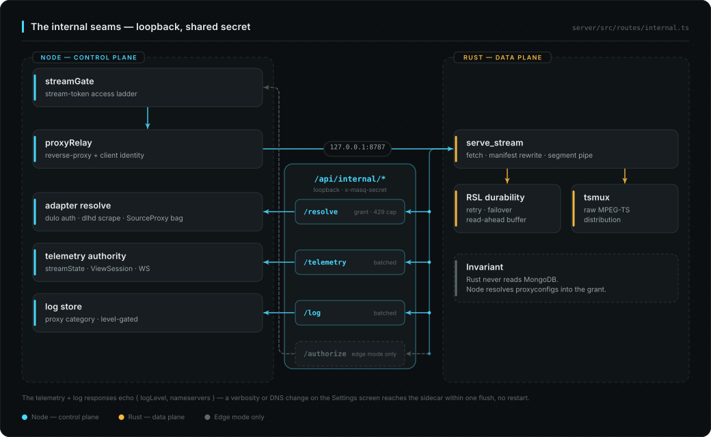

- **resolve** (`/api/internal/resolve`) — Rust asks Node to resolve a stream; Node runs the adapter logic and
  returns a per-stream **grant** that Rust replays for the whole stream: the resolved `target`, the
  `upstreamHeaders` for every hop, `relabelSegment`, `allowPrivate`, the resolved `proxyConfig`, the
  adapter's declared capabilities (`playerSelectable`, `adSignature`, `segmentUnwrap`), the target's own
  `expiresAtMs` when the adapter knows it, and `policySource` / `failover` for a failover candidate. There is
  no host list in it: Rust seeds its per-source SSRF allow-set from `target` and grows it from the hosts it
  finds in the manifests it rewrites. Two non-grant answers are terminal: `410 failover_exhausted` ends a
  failover walk, and `429 source_stream_cap` (a source at its concurrent-stream limit) is relayed to the
  player as-is — no walk, no retry. Node sends that `429` only where no candidate could carry the stream
  instead; a limit a failover backup can route around is answered as an ordinary walkable `502`, and its
  error is never `source_stream_cap`. A re-resolve the data plane makes *because* its target failed carries a
  `reason`; `target_rejected` and `refresh_failed` ask the adapter for a freshly resolved target rather than
  one it cached (`ResolveStreamOptions.fresh`), while a scheduled renewal carries none.
- **telemetry** (`/api/internal/telemetry`) — Rust measures the true byte edge and reports batched
  viewer / byte / phase / close events; Node stays the telemetry authority (Active Streams WS,
  History / Metrics, persisted `ViewSession`).
- **log** (`/api/internal/log`) — Rust ships level-gated, request-tagged engine logs into the dedicated
  **`proxy`** log category — the same "View logs" drawer as everything else.
- **authorize** (`/api/internal/authorize`) — **edge mode only** (below): the per-request stream-token check
  when Rust owns the public socket.

The telemetry + log responses both **echo `{ logLevel, nameservers }`**, so changing verbosity or the DNS
nameservers on the Settings screen reaches the sidecar within one flush — no restart. Both are also stamped
into the sidecar's environment at spawn (`MASQ_LOG_LEVEL`, `MASQ_NAMESERVERS`). The nameservers drive the
data plane's **upstream** resolver with the same semantics as Node's `dns.ts` — configured servers first, the
OS resolver on any failure (NXDOMAIN included, so `.local` / LAN names keep working), IP literals never
resolved, A before AAAA — while Rust's own loopback calls to Node always stay on the system resolver, so no
DNS setting can cut the data plane off from its control plane.

## How a stream request flows

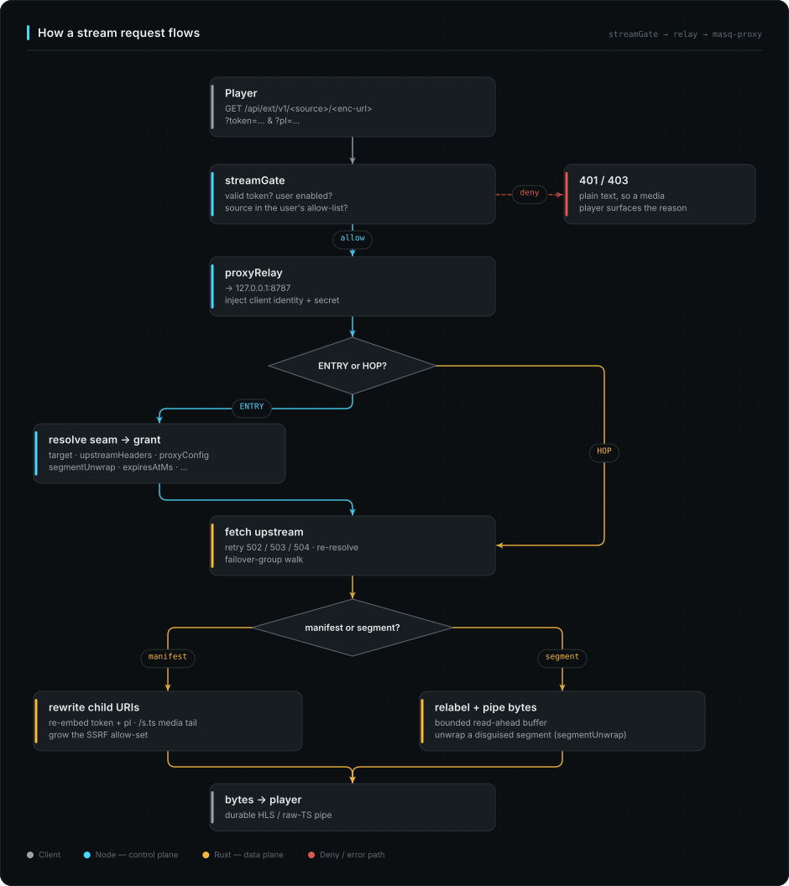

1. A player requests `/api/v1/…` (in-app) or `/api/ext/v1/…` (external clients; the mount the composed M3U
   always emits), carrying the per-user `?token=` and the `?pl=` playlist id.
2. The **stream-token gate** runs first: valid token? enabled? (for a non-admin) is this source in the user's
   allow-list? Denials are **plain text** so a media player surfaces them.
3. On allow, Node **relays** the request to the sidecar and adds the client identity it can see (IP, UA,
   username) plus the shared secret.
4. Inside Rust, the **first** request (ENTRY) resolves via the seam to get the grant + master URL; **child**
   requests (HOP — variant playlists, segments, keys) reuse the cached policy. Manifests are rewritten so
   every child URL routes back through the proxy with the token re-embedded; segments are relabelled — and,
   for a source whose grant carries `segmentUnwrap`, stripped of their disguise — and piped straight through.
5. A media **segment** whose upstream name a libavformat client would refuse (`.png`, `.image?…`, any
   signed `?query`) gets a clean **media tail** on its hop URL — `…/h/<encoded upstream>/s.ts?token=…` —
   that the router strips again before decoding. ffmpeg's HLS demuxer (mpv, Jellyfin, Plex, Channels) checks
   every segment URL's extension against the format it detects in the bytes; hls.js, VHS and ExoPlayer never
   did. The tail keeps the upstream's own extension when that one passes (`a.mp3?sig` → `/s.mp3`), uses
   `/s.vtt` in a WebVTT playlist, and never touches keys, init sections or playlists; a plain `seg.ts` hop
   keeps its old shape byte for byte, and hops minted before tails existed still route.

## Durability + raw-TS

The Rust engine is built to keep a stream alive on flaky upstreams:

- **Retry** — transient upstream failures (transport errors + `502` / `503` / `504`) are retried with bounded
  backoff; definitive `4xx` / `5xx` are forwarded verbatim (unless `failoverOnDefiniteError` routes them into
  the failover walk below).
- **Mirror failover** — a dead resolved master forces a **fresh resolve**, driving dlhd to re-probe and
  rotate to a live mirror mid-stream.
- **Alternate upstreams** — where a source exposes several interchangeable providers per channel (dlhd's
  Player 1..6), a failed establish first re-resolves the SAME channel through a **different provider**
  before any configured backup is considered. See [DaddyLive players](#daddylive-players-alternate-upstreams).
- **Failover groups** — when a channel has configured backups and its stream still won't establish, the
  engine walks the ordered children (`attempt=1,2,…` against the resolve seam) and serves the first live
  one under the parent's identity, then sticks to it for the session. See
  [Failover groups](#failover-groups-channel-backups).
- **Signed-URL expiry** — a resolved target is normally reused for 60 s; when the grant says when it expires
  (`expiresAtMs`), it is reused only until 60 s before that (never less than 5 s), so a reused signed URL never
  lapses mid-poll. A definitive `401` / `403` / `410` on an ENTRY drops the cached target as well, so the next
  request re-resolves instead of replaying a dead URL for the rest of the minute (at most once per entry per
  minute). That re-resolve — and the origin ingest's re-resolve after a failed playlist refresh — tells Node
  why, so an adapter that reuses its resolved targets (ZLive's signed links) mints a new one instead of handing
  back the one that just failed, within its own rate limit.
- **Stream-limit refusal** — a source at its concurrent-stream limit answers a new channel with
  `429 source_stream_cap`. That is policy, not a fault: the player gets the `429` and Node's message as plain
  text, with no failover walk, no retry loop and no upstream telemetry. When a failover backup on another
  provider could carry the channel, Node answers a walkable `502` instead and the walk plays the backup.
- **Stall detection** — an idle read timeout (`readTimeoutMs`) turns a silent upstream into a clean truncation
  instead of a hang.
- **Read-ahead buffer** — a bounded in-memory buffer (`bufferSizeKb`) smooths jitter and fixes the
  chunked / no-Content-Length byte undercount that used to fake client-side buffering.
- **Batched telemetry** — events are coalesced and posted off the hot path, so reporting never blocks bytes.
- **Raw MPEG-TS** — with `outputFormat: 'ts'`, an external-mount stream is served as **one continuous
  `video/mp2t`** stream (segments concatenated, no remux) for players that prefer a flat TS pipe. On the
  passthrough path fMP4 / AES sources auto-fall back to HLS; with
  [local origin](#local-origin--republishing-the-stream) enabled AES-128 is decrypted at ingest instead, so
  only fMP4 and `SAMPLE-AES` still decline. A **demuxed** source needs more than concatenation — origin mode
  [interleaves the pair](#demuxed-sources-and-the-interleaving-muxer) into one program rather than declining.
  With local origin — and on the pass-through path for a `segmentUnwrap` source — a socket's **first** segment
  is trimmed to start on a keyframe (see [keyframe joins](#signed-urls-disguised-segments-and-keyframe-joins)),
  so a join never opens on seconds of undecodable picture.

## Local origin — republishing the stream

Everything above describes a **rewriting proxy**: the upstream playlist is fetched, its URIs are rewritten to
point back through masqueradarr, and the rest is passed through. That hides hostnames, but the client is still
looking at the *provider's* timeline — their media sequence, their `#EXT-X-KEY`, even their vendor tags.

With **`originEnabled`**, masqueradarr becomes the **origin** instead. One **ingest per channel** (not per
viewer) follows the upstream, decrypts each segment, and pushes it into an in-memory **ring**; both output
shapes are then rendered from that ring:

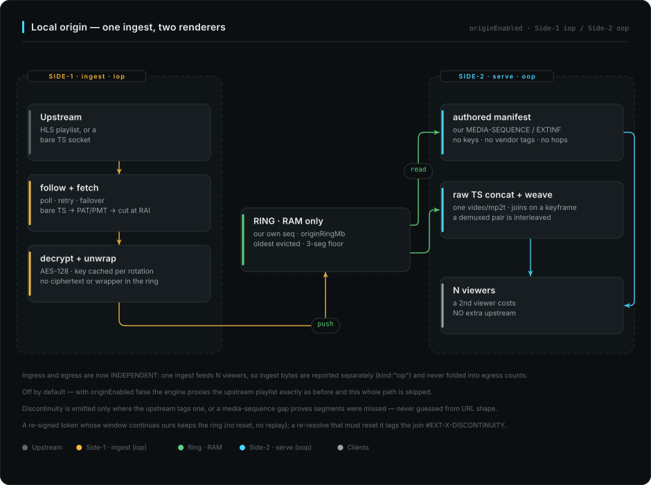


| | `originEnabled: false` | `originEnabled: true` |
|---|---|---|
| `outputFormat: 'hls'` | the upstream playlist, URI-rewritten | a playlist **we authored** + our own segment paths |
| `outputFormat: 'ts'` | upstream segments concatenated per viewer | the same ring concatenated (decrypts); a demuxed source is **interleaved** into one program |

What a player receives in origin mode contains **no provider host, path, session id or query; no
`#EXT-X-KEY`; no vendor tags; no proxy hop URLs** — only our own `#EXT-X-MEDIA-SEQUENCE`, `#EXTINF`, and
`/api/…/o/<entry>/<generation>-<seq>.ts` segment paths (still token-gated, since those paths are guessable by
construction).

Three consequences worth knowing:

- **A second viewer of a channel costs no extra upstream bandwidth.** The passthrough path fetches per
  viewer; the ring is shared.
- **Encrypted sources become fully supported rather than degraded.** AES-128 is decrypted at ingest, so
  `outputFormat: 'ts'` works on sources that previously fell back to HLS. `SAMPLE-AES` / FairPlay and fMP4
  remain out of scope and decline cleanly, with a WARN naming the reason.
- **Ad-stitched sources still show `#EXT-X-DISCONTINUITY`** at real splices. That is in-spec output, not a
  leak — it says nothing about the origin — and every player handles it. The engine emits it only where the
  upstream tags one, or where a media-sequence gap proves segments were missed; it deliberately does *not*
  guess splices from URL shape (that was tried, and produced false positives on two different CDNs).

### Demuxed sources and the interleaving muxer

**Audio in its own `#EXT-X-MEDIA` rendition.** Some providers — pluto on every device
cohort — offer no muxed variant at all: every `#EXT-X-STREAM-INF` defers its audio to a separate rendition
playlist. Following the variant alone would ring, and serve, **video only**. The engine therefore rings the
**pair**: one ring entry holds the video segment *and* its audio partner, and the entry URL answers with a
small **master we author** over two media playlists of our own (`…/o/<entry>/v.m3u8` and
`…/o/<entry>/a.m3u8`).

Three properties make this safe, and all three are load-bearing:

- **The pair is matched on the wall clock, not the sequence number.** `#EXT-X-PROGRAM-DATE-TIME` dates the
  media itself, so it survives a renumbering; the media sequence only *looks* like a cross-rendition identity.
  Pluto renumbers the two renditions independently across a session renewal — its stitcher ends the playlist
  every ~25 s — so a fresh video playlist can open at sequence 10 against the audio's 11 **for the same
  media**, and index pairing then puts every pair of that session about one segment out. The sequence index
  remains the fallback for a source that publishes no PDT, where an aligned pair resolves to the same segment
  either way. Each lane's *own* sequence still matters once a partner is picked: an absent `#EXT-X-KEY` IV is
  derived from it (RFC 8216 §5.2), and the two lanes' numbers are exactly what diverge.
- **One offset, both lanes.** A single affine shift is computed from the *video* lane's DTS and applied to
  both renditions, so the source's authored A/V skew is translated rather than replaced. Computing an offset
  per lane would manufacture a lip-sync error that was not in the source. A skew guard declines the pair
  outright if the lanes' offset ever moves more than half a second from the skew locked on the first pair —
  it bounds the DRIFT, not the skew's own magnitude, which a source is free to author as large as it likes —
  and a declined pair publishes **both** lanes verbatim so they stay in sync with each other.
- **Both lanes get the PID remap.** An ad creative is JIT-transmuxed into separate video and audio sources
  with their own arbitrary PSI, so the pids churn on *both* sides of a pod edge — normalising only the video
  would leave the audio track dying at every break.

The two authored playlists are rendered from the same ring entries, so their media sequence, discontinuity
sequence, `#EXTINF` ladder and `#EXT-X-PROGRAM-DATE-TIME` anchors are identical by construction.

**`outputFormat: 'ts'` on a demuxed source — the interleaving muxer.** HLS can publish a pair as two
playlists; raw TS is *one socket*, and two transport streams do not concatenate. That used to be a decline,
which meant the one source shape local origin exists for was exactly the shape raw TS could not serve. It is
now woven instead: the two lanes are folded into **one authored program** on the way out, off the same ring
the HLS lanes are rendered from.

The muxer is small because the pairing above already did the hard part — one shared clock, disjoint canonical
pids, correct per-pid continuity counters. So the weave is transport-layer only, with **no decode, no
re-encode and no timestamp rewriting**: drop each lane's PSI and padding, emit one PAT + one PMT declaring
both elementary streams, and merge the two lanes' PES access units in **decode order** (video keyed on DTS,
audio on PTS — for AAC they are the same thing). Per-pid packet order survives by construction, because an
access unit is contiguous within its pid.

Three details worth knowing:

- **No PCR is generated.** The video lane's clock references were already shifted by the shared offset and the
  merge keeps the video lane's relative order, so PCR stays monotonic and its spacing *in stream time* is
  unchanged. The published PMT names the video pid as `PCR_PID`.
- **The published program is locked** on the first woven pair and re-emitted byte-identically, on a ~110 ms
  cadence so a demuxer that resyncs finds it again quickly. A later pair whose stream set differs is declined
  rather than republished under a changed table — a PMT that changes shape mid-socket is itself a
  reconfiguration event.
- **A declined pair is skipped**, not served verbatim: there is no verbatim option when the output is one
  socket. The reason is logged under `oop`, latched per distinct cause, and three consecutive declines end the
  socket cleanly so the client reconnects instead of watching a stream that is open but frozen.

`spliceNormalize` does **not** gate this path — it is the kill switch for splice *absorption*, but authoring
one program out of two renditions requires the pid remap and shared clock to exist at all. Set
`outputFormat: 'hls'` to publish the two renditions untouched.

**RAM, not disk.** The ring holds *decrypted* media and is never written to disk. It is bounded per channel
by `originRingMb` (default 25 MiB ≈ a minute at 3.3 Mbps), oldest segment evicted first, with a hard floor of
3 segments so the window stays playable — when a source's bitrate makes the floor beat the cap, that is
logged so the cap can be raised rather than leaving unexplained stalls. There is **no global ceiling across
channels yet**, so a many-channel box wants a conservative per-channel value.

**Bare-TS sources.** A `direct` / `hdhomerun` upstream arrives as one endless socket with no playlist, so the
engine finds the boundaries itself: it reads the PSI tables (PAT → PMT) for the video PID and cuts at packets
flagged as random-access points, deriving each segment's duration from the stream's own PCR clock. Those
segments join the same ring, so such a source republishes as ordinary HLS.

**Observability — `iop` vs `oop`.** Once one ingest feeds N viewers, ingress and egress are independent
quantities, so a stuttering channel has two possible causes. The engine tags every ingest line **`iop`**
(input operation — resolve, poll, fetch, decrypt, ring push/evict) and every serving line **`oop`** (output
operation — manifest render, segment serve, TS concat), both under the `proxy` log category. Active Streams
shows both sides per channel: `Delivery` is what viewers receive, `Ingest` / `Ring` / `Upstream pulled` is
what the single shared ingest is doing.

### Signed URLs, disguised segments and keyframe joins

Some upstreams hand out URLs that expire, hide their media inside another container, or cut segments that do
not start on a picture a decoder can show. [ZLive](#zlive-operator-notes) does all three; none of the handling
below is keyed on it.

- **Disguised segments.** A segment can arrive wrapped — ZLive's are RIFF/WEBP images from a TikTok CDN whose
  EXIF chunk *is* the transport stream, 42 bytes in. The ingest unwraps **every** source's segments at fetch
  time (a slice, not a remux — the TS bytes are untouched), so the splice scan, the ring and both renderers
  only ever see clean TS; the wrapper is reported on the ingest's `iop` telemetry (`segmentWrapper`) and logged
  once. Detection is structural, never a fixed offset: a body that already starts on a sync byte is left alone;
  otherwise a RIFF/WEBP chunk walk takes an EXIF payload that starts on `0x47` and is a whole number of
  188-byte packets; otherwise the first offset within 4 KiB where five sync bytes line up 188 bytes apart.
  fMP4, ADTS audio, WebVTT, keys and HTML are never touched. The pass-through paths — the relay and the
  pass-through raw-TS producer — strip a wrapper only for a policy whose grant carries `segmentUnwrap`
  (streaming, holding at most ~5 KB), so every other source's bytes stay byte-identical; for those policies
  the rewritten playlist also drops a false `#EXT-X-INDEPENDENT-SEGMENTS`.
- **Token continuity.** When the ingest re-resolves the **same** candidate (not a failover escalation) and the
  fresh window still lists — or abuts, or has slid at most 30 segments past — the segment it would have
  fetched next, it keeps the ring, its generation, the splicers and the upstream cursor: the overlap is
  deduped, a slide is still marked as a sequence gap, and viewers see nothing change. Anything else (a
  different candidate, an escalation, a window renumbered below ours) resets the ring **and** forces
  `#EXT-X-DISCONTINUITY` onto the first new segment. Before this, an expired signed URL dropped the whole ring:
  every segment URL a client held turned `404`, every viewer waited for three segments to re-land, and the
  overlap replayed as new media with no tag to warn the player.
- **Renewal ahead of expiry.** With `expiresAtMs` in the grant, the ingest re-resolves 60 s before the target
  expires (never sooner than 30 s after the resolve that scheduled it) through the keep-ring path above, while
  the old target still plays; a failed renewal retries in 15 s.
- **Bounded reads and backoff.** Every origin read — segment, key, playlist refresh, the entry, a bare-TS
  socket's silence — is bounded by max(`readTimeoutMs`, 3 × target duration (capped at 120 s), 10 s); before,
  a CDN connection that went quiet mid-body could park the ingest forever with the ring frozen. Repeated
  failures back off 2 s → 4 → 8 … → 60 s and reset when media lands, but the **first** retry is immediate — so
  a routine expiry `403` followed by a fresh resolve never waits.
- **Refusals end promptly.** An ingest whose resolve is refused with `429 source_stream_cap` stops at once, and
  clients asking for that channel get the `429` straight away instead of a `503` after waiting 20 s for a ring
  that will never fill.
- **Keyframe joins.** A raw-TS socket's first segment is cut to start at the PAT/PMT plus the packet that opens
  the first keyframe (H.264 IDR, HEVC IRAP), found by a full NAL scan — ZLive sets the random-access flag on
  every video PES, so the flag alone proves nothing. Only that socket's bytes are trimmed: the shared ring is
  untouched, a segment with no keyframe is sent whole, and later segments stream as before. On the origin this
  applies to every source; on the pass-through raw-TS path, to `segmentUnwrap` sources.

## Tuning knobs — the `proxyconfigs` subsystem

The engine's knobs live in the `proxyconfigs` collection (the `videoconfig` successor), edited in the UI and
resolved by Node into each grant (**Rust never reads MongoDB**). Two tiers, doc-level fallback:

- **`_id: 'app'`** — the **(Default)** config applied to every playlist. Edited on **Settings → Advanced**.
- **`_id: 'app_<playlistId>'`** — a **(Custom)** per-playlist override that fully replaces the Default for that
  playlist. Edited in the **playlist drawer** (`ProxyConfigPanel.vue`, auto-saved).

| Knob | Status | Effect |
|---|---|---|
| `headerOverrides` | live | extra upstream headers, merged over the adapter's (operator wins) |
| `connectTimeoutMs`, `maxRedirects` | live | per-config upstream HTTP client (cached in Rust) |
| `readTimeoutMs`, `bufferSizeKb` | live | per-stream stall timeout + read-ahead buffer size (on the origin, `readTimeoutMs` is one term of the ingest's read bound) |
| `outputFormat` (`hls` \| `ts`) | live | distribution shape (`ts` = continuous MPEG-TS, external mount only) |
| `originEnabled` | live | [local origin](#local-origin--republishing-the-stream): republish from our own ring instead of proxying the upstream playlist (default **off** = today's output byte-for-byte). Forced **on** in the grant for a source that declares `originRequired` (ZLive), whatever the stored value — the panel shows *forced by <source>*, and keeps `originRingMb` / `spliceNormalize` editable even with its own toggle off, because those streams run on them |
| `originRingMb` | live | per-channel ring cap in MiB (default **25**); a 3-segment floor still wins over it |
| `failoverEnabled` | live | walk a channel's ordered failover children on an establish failure (default **on**) |
| `failoverOnDefiniteError` | live | also treat a definitive upstream `4xx`/`5xx` as a failover trigger (default **off**) |
| `segmentCacheTtlSec` | reserved | shipped in the grant, not yet enforced |

## Public edge mode (`MASQ_EDGE`)

By default Node is the **public front door** and Rust is a **loopback-only sidecar** it relays bytes to.
Setting **`MASQ_EDGE=1`** *inverts* the topology: **Rust binds the public port** and serves streams
**in-process**, while **reverse-proxying everything else** — the SPA, `/api/*`, the token-free `.m3u` / guide
downloads, and all four WebSockets — back to Node on a loopback internal port. The public port and `DOMAIN`
are unchanged, and it's **fully reversible** by clearing the flag (no rebuild).

**Default — `MASQ_EDGE` off (Node is the front door):**

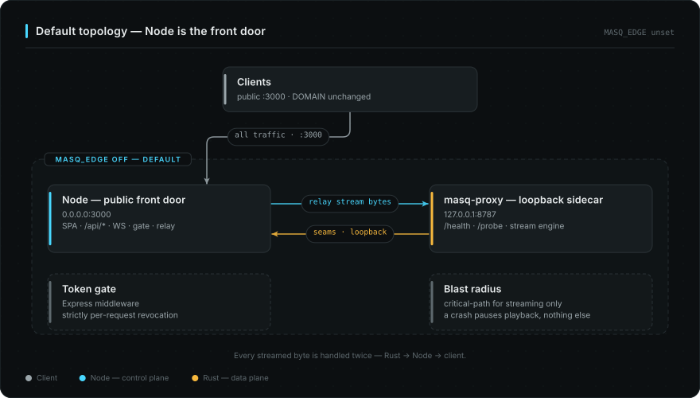

**`MASQ_EDGE=1` (Rust is the front door):**

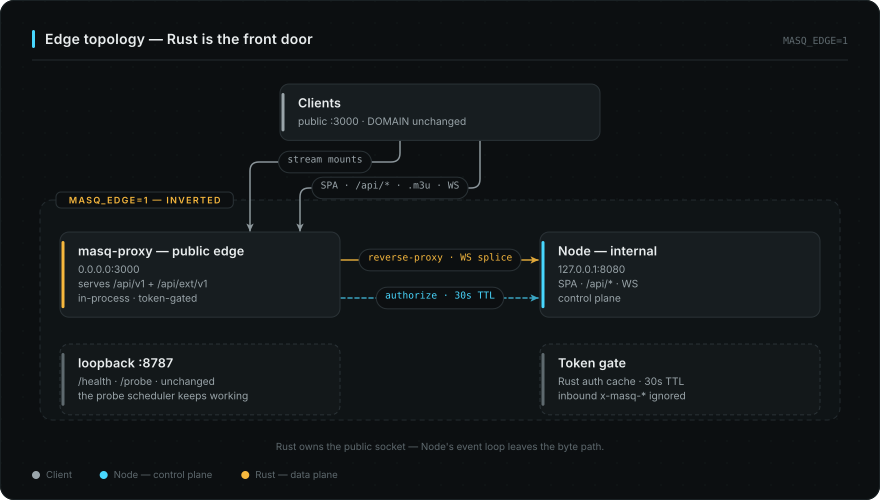

**What changes under the hood.** In edge mode the token gate can't be Express middleware (Rust owns the
socket), so it becomes a **per-request check** against a small Rust auth cache backed by
`POST /api/internal/authorize` — revocation lands within a **30-second TTL** (vs. strictly per-request in the
default topology). The edge **synthesizes client identity server-side** (forwarded-or-peer IP, real
User-Agent, gated username) and **ignores inbound `x-masq-*`** headers, so a public client can't spoof them.
Rust's loopback `:8787` listener (`/health` + `/probe`) is unchanged, so the channel-probe scheduler keeps
working. Because Rust is now on the critical path for *all* traffic, Node restarts it **unboundedly**.

### When to turn it on (and when not to)

The core idea: **take Node's single-threaded event loop out of the video byte path.** In the default topology
every streamed byte is handled twice (Rust → Node → client); edge mode removes that hop.

- **Many concurrent or high-bitrate viewers** *(the main reason)* — once you're serving dozens of streams (or
  a few 4K ones), Node's event loop becomes the throughput ceiling and adds jitter to everything, including
  the dashboards you monitor from. Rust shovels bytes far better without starving the control plane.
- **Keep the management UI responsive under streaming load** — Node's loop stays free for the SPA, the live
  WebSockets, and logs no matter how much video is flowing.
- **Constrained hardware (Raspberry Pi / small VPS)** — halving the per-byte copies lets the same box serve
  noticeably more streams.
- **Lowest-latency, most-durable public path** — the durability engine already lives in Rust; edge mode
  applies its backpressure straight to the client socket instead of through Node's pipe.
- **When to leave it off** — a personal setup with a handful of viewers gains nothing, and the default
  (sidecar) topology is the simpler, more battle-tested path, keeps strictly per-request token revocation, and
  has a smaller blast radius (Rust is critical-path only for streaming, not everything). Edge mode is build-
  and unit-verified, but a full runtime end-to-end pass on a live stack is still pending — treat it as an
  opt-in scale / performance topology, not the default.
