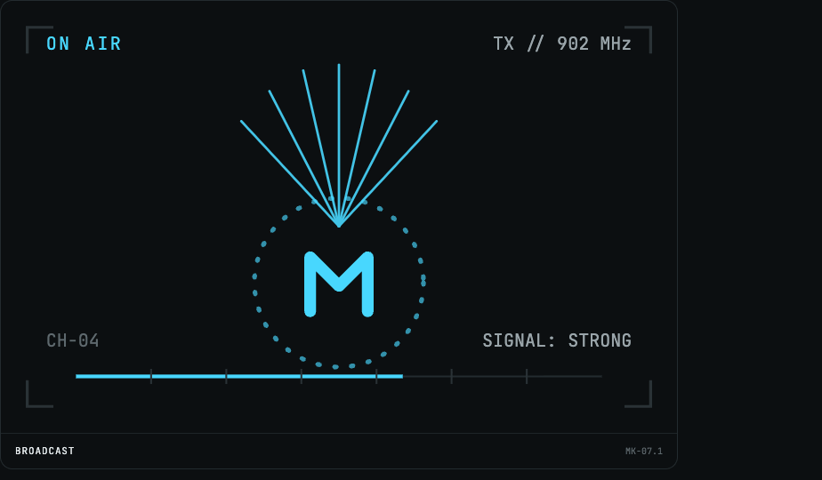
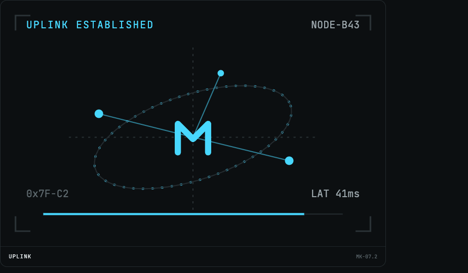
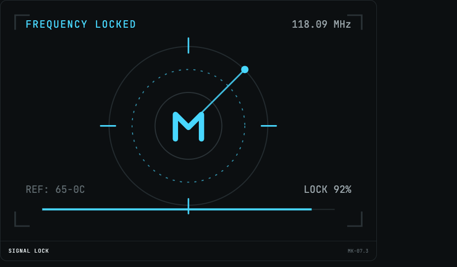
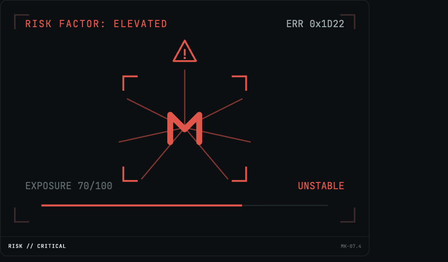
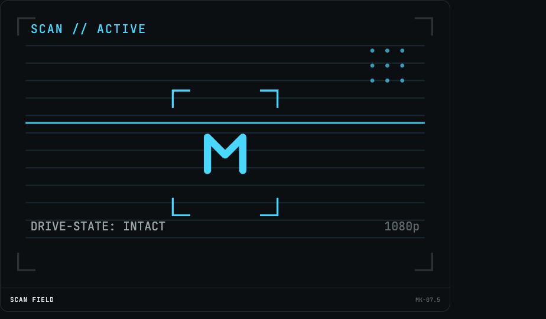
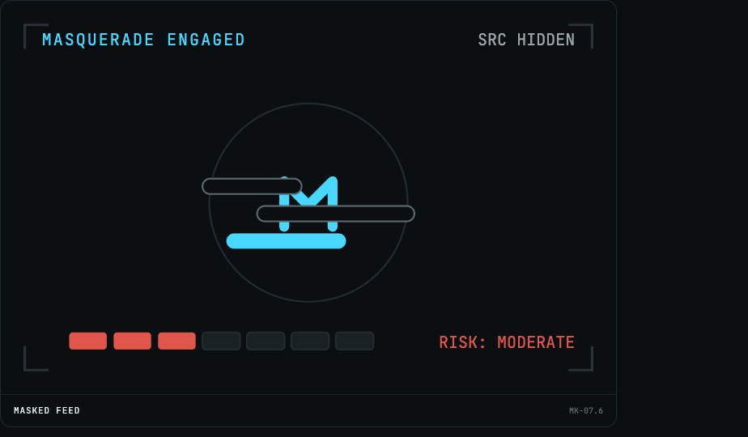

# Emblem-Sets: masqueradarr

List of swag emblem-sets you can use in your applications. Click on the [Icon Link](./README.md) for each emblem to get the real image file.

| Icon | Icon Link | Size |
| --- | --- | --- |
|  | [01-emblem.png](./01-emblem.png) | `924x540` |
|  | [02-emblem.png](./02-emblem.png) | `924x540` |
|  | [03-emblem.png](./02-emblem.png) | `924x540` |
|  | [04-emblem.png](./04-emblem.png) | `924x540` |
|  | [05-emblem.png](./05-emblem.png) | `924x540` |
|  | [06-emblem.png](./06-emblem.png) | `924x540` |