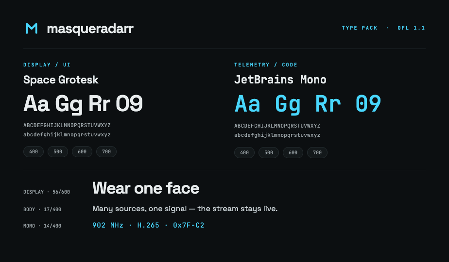

# Masqueradarr — Type Pack



Two open-source families carry the brand:

| Family | Role | Weights |
|---|---|---|
| **Space Grotesk** | Display, headings, UI, wordmark | 400 · 500 · 600 · 700 |
| **JetBrains Mono** | Telemetry, IDs, code, technical UI | 400 · 500 · 600 · 700 |

Both are licensed under the **SIL Open Font License 1.1** — free to use, embed, and self-host in commercial work.

## What's in this pack
- `masqueradarr-type.css` — font loading + brand type tokens + ready-to-use classes
- `embed.html` — `<link>` snippet for `<head>`
- `masqueradarr-type.tokens.json` — machine-readable type scale
- `specimen.png` — visual reference sheet

> The actual `.woff2`/`.ttf` binaries are **not bundled** — grab them from the official sources below (links rather than redistributed files keep you on the latest, correctly-licensed builds).

## Install — pick one

**A · Google CDN (fastest start)**
Paste `embed.html` into your `<head>`, then `@import` or link `masqueradarr-type.css`.

**B · Self-host (recommended for production)**
Download the families, drop the `.woff2` into `./fonts/`, then uncomment the `@font-face` block at the bottom of `masqueradarr-type.css` and delete the `@import` line.

- Space Grotesk → https://fonts.google.com/specimen/Space+Grotesk
- JetBrains Mono → https://fonts.google.com/specimen/JetBrains+Mono
- Or via npm: `npm i @fontsource/space-grotesk @fontsource/jetbrains-mono`

## Type scale

| Role | Font | Size / Line | Weight | Tracking |
|---|---|---|---|---|
| Display | Space Grotesk | 56 / 1.0 | 600 | −0.035em |
| Heading 1 | Space Grotesk | 38 / 1.05 | 600 | −0.02em |
| Heading 2 | Space Grotesk | 26 / 1.15 | 600 | −0.015em |
| Body | Space Grotesk | 17 / 1.6 | 400 | 0 |
| Label / overline | Space Grotesk | 12 / 1.0 | 500 | +0.20em · UPPERCASE |
| Mono / code | JetBrains Mono | 13–14 / 1.5 | 400–500 | +0.06em |

**Wordmark** — always lowercase, weight 600, tracking −0.03em (`masqueradarr`).

## Usage

```html
<link rel="stylesheet" href="masqueradarr-type.css">

<h1 class="mq-display">Wear one face</h1>
<p class="mq-body">The stream stays live.</p>
<span class="mq-mono">902 MHz · H.265</span>
<span class="mq-wordmark">masqueradarr</span>
```

Or with tokens directly: `font: var(--mq-h1);`

# Summary

```css
/* ============================================================
   Masqueradarr — Type Pack
   Typefaces:  Space Grotesk (display / UI)  ·  JetBrains Mono (telemetry / code)
   Weights:    400 · 500 · 600 · 700
   License:    SIL Open Font License 1.1 (both families) — see README.md
   ============================================================ */

/* --- 1. Load the fonts -------------------------------------------------
   Option A — Google CDN (quickest). Keep this @import, or move the
   equivalent <link> tags into <head> (see embed.html) for faster loads.
   Option B — Self-host: delete the @import, drop the woff2 files into
   ./fonts/ and uncomment the @font-face block at the bottom of this file. */

@import url('https://fonts.googleapis.com/css2?family=Space+Grotesk:wght@400;500;600;700&family=JetBrains+Mono:wght@400;500;600;700&display=swap');

/* --- 2. Tokens --------------------------------------------------------- */
:root {
  /* families */
  --mq-font-sans: 'Space Grotesk', system-ui, sans-serif;
  --mq-font-mono: 'JetBrains Mono', ui-monospace, monospace;

  /* type roles  (shorthand: weight size/line family) */
  --mq-display: 600 56px/1    var(--mq-font-sans);  /* letter-spacing: -0.035em */
  --mq-h1:      600 38px/1.05 var(--mq-font-sans);  /* letter-spacing: -0.02em  */
  --mq-h2:      600 26px/1.15 var(--mq-font-sans);  /* letter-spacing: -0.015em */
  --mq-body:    400 17px/1.6  var(--mq-font-sans);
  --mq-label:   500 12px/1    var(--mq-font-sans);  /* uppercase · +0.20em */
  --mq-mono:    400 14px/1.5  var(--mq-font-mono);  /* +0.06em */

  /* text colors (for reference) */
  --mq-ink:     #E9EDEE;
  --mq-muted:   #9AA5AA;
  --mq-code:    #C7D0D4;
  --mq-signal:  #48D7FE;
}

/* --- 3. Ready-to-use classes ------------------------------------------ */
.mq-display { font: var(--mq-display); letter-spacing: -0.035em; }
.mq-h1      { font: var(--mq-h1);      letter-spacing: -0.02em;  }
.mq-h2      { font: var(--mq-h2);      letter-spacing: -0.015em; }
.mq-body    { font: var(--mq-body); }
.mq-label   { font: var(--mq-label);   letter-spacing: 0.20em; text-transform: uppercase; }
.mq-mono    { font: var(--mq-mono);    letter-spacing: 0.06em; }

/* wordmark — always lowercase */
.mq-wordmark { font-family: var(--mq-font-sans); font-weight: 600; letter-spacing: -0.03em; text-transform: lowercase; }

/* --- 4. Self-host @font-face (Option B) --------------------------------
   Download the woff2 files (see README) into ./fonts/ then uncomment.

@font-face { font-family:'Space Grotesk'; font-style:normal; font-weight:400 700;
  font-display:swap; src:url('./fonts/SpaceGrotesk-Variable.woff2') format('woff2'); }
@font-face { font-family:'JetBrains Mono'; font-style:normal; font-weight:400 700;
  font-display:swap; src:url('./fonts/JetBrainsMono-Variable.woff2') format('woff2'); }
--------------------------------------------------------------------- */
```

```json
{
  "family": {
    "sans": "Space Grotesk, system-ui, sans-serif",
    "mono": "JetBrains Mono, ui-monospace, monospace"
  },
  "weights": [400, 500, 600, 700],
  "roles": {
    "display":  { "weight": 600, "size": 56, "line": 1.0,  "tracking": "-0.035em", "family": "sans" },
    "h1":       { "weight": 600, "size": 38, "line": 1.05, "tracking": "-0.02em",  "family": "sans" },
    "h2":       { "weight": 600, "size": 26, "line": 1.15, "tracking": "-0.015em", "family": "sans" },
    "body":     { "weight": 400, "size": 17, "line": 1.6,  "tracking": "0",        "family": "sans" },
    "label":    { "weight": 500, "size": 12, "line": 1.0,  "tracking": "0.20em",   "family": "sans", "transform": "uppercase" },
    "mono":     { "weight": 400, "size": 14, "line": 1.5,  "tracking": "0.06em",   "family": "mono" }
  },
  "wordmark": { "weight": 600, "tracking": "-0.03em", "transform": "lowercase", "family": "sans" }
}

```