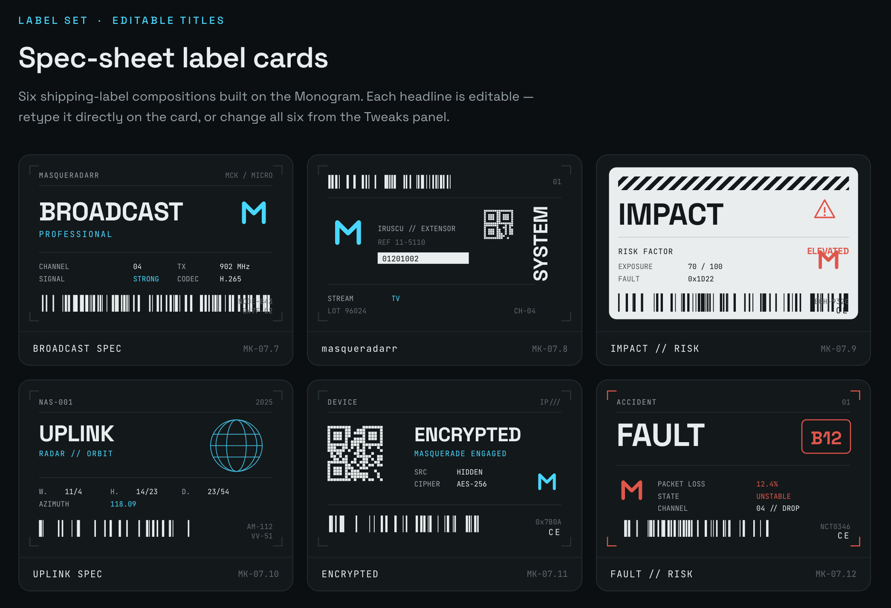
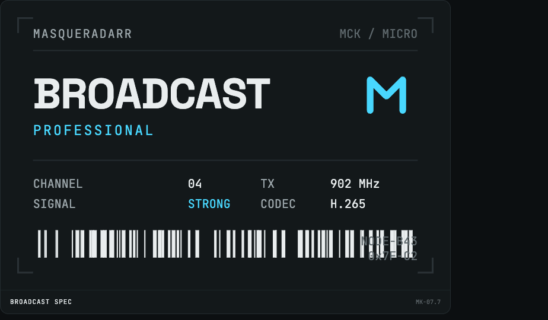
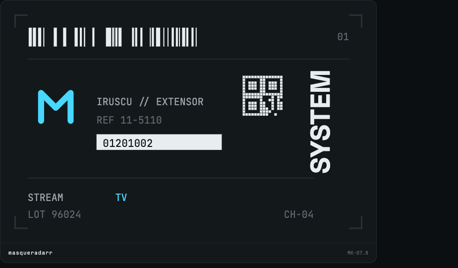
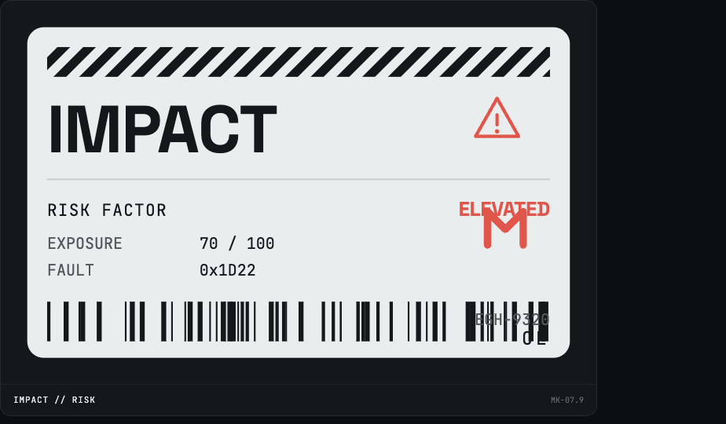
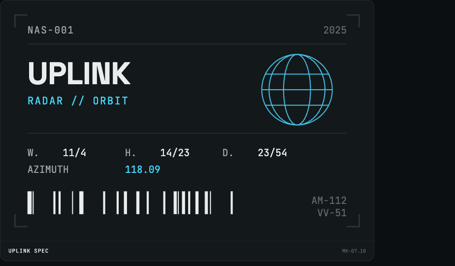
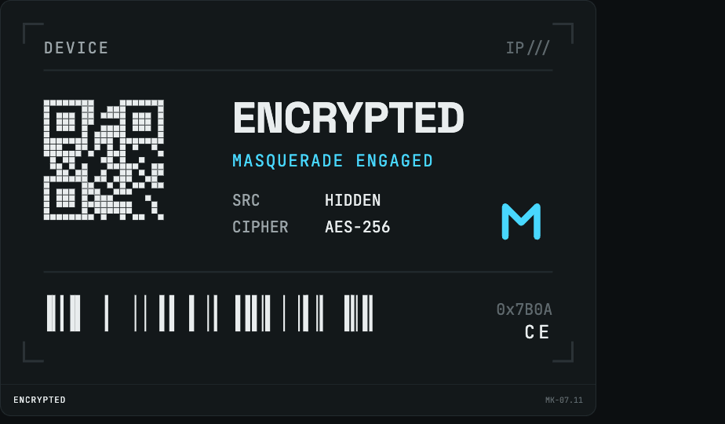
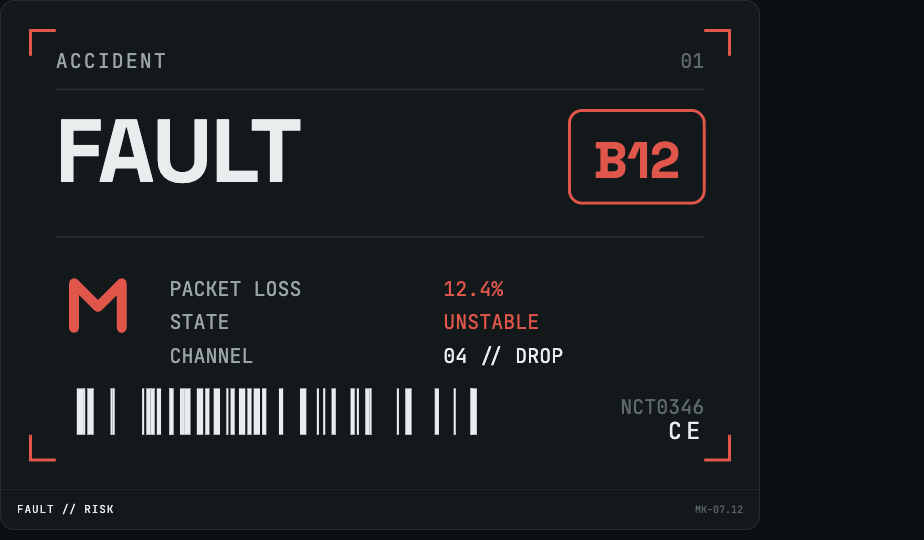

# Label-Sets: masqueradarr

List of swag label-sets you can use in your applications. Click on the [Icon Link](./README.md) for each label to get the real image file.

| Icon | Icon Link | Size |
| --- | --- | --- |
|  | [01-card.png](https://raw.githubusercontent.com/TheBinaryNinja/masqueradarr/refs/heads/main/docs/label-sets/01-card.png) | `924x540` |
|  | [02-card.png](https://raw.githubusercontent.com/TheBinaryNinja/masqueradarr/refs/heads/main/docs/label-sets/02-card.png) | `924x540` |
|  | [03-card.png](https://raw.githubusercontent.com/TheBinaryNinja/masqueradarr/refs/heads/main/docs/label-sets/02-card.png) | `924x540` |
|  | [04-card.png](https://raw.githubusercontent.com/TheBinaryNinja/masqueradarr/refs/heads/main/docs/label-sets/04-card.png) | `924x540` |
|  | [05-card.png](https://raw.githubusercontent.com/TheBinaryNinja/masqueradarr/refs/heads/main/docs/label-sets/05-card.png) | `924x540` |
|  | [06-card.png](https://raw.githubusercontent.com/TheBinaryNinja/masqueradarr/refs/heads/main/docs/label-sets/06-card.png) | `924x540` |